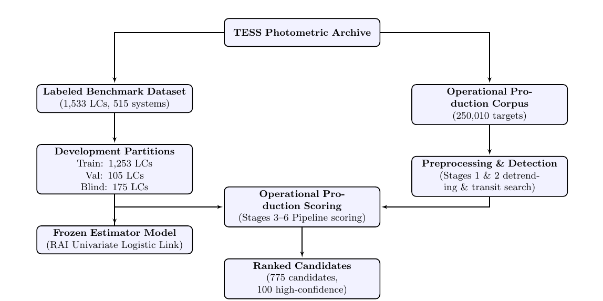

# Recovery Ambiguity in Exoplanet Vetting: A Parsimonious Graph-Theoretic Approach to Transit Candidate Validation

## **Authors**: Roshan Kumar Gupta (Department of CSE, Chandigarh University)

## Abstract

**Background**: Wide-field transit surveys produce tens of thousands of exoplanet candidates, requiring automated classification pipelines to identify true planet transits. Traditional vetting pipelines build complex machine learning classifiers utilizing dozens of correlated features to evaluate transit morphology, often leading to model overfitting and uncalibrated probabilities.

**Objective**: We present a method that isolates and estimates exoplanet signal recovery ambiguity through a single, physically interpretable graph-derived index—the Recovery Ambiguity Index (RAI)—simplifying transit vetting while improving calibration.

**Methods**: We introduce the **Recovery Ambiguity Index (RAI)**, a parsimonious index constructed from five standardized graph-theoretic and harmonic sub-features that capture the dispersion and connection of period aliases. We evaluate a univariate logistic model using only the RAI against multi-feature ensembles on an independent blind validation partition consisting of $N = 175$ TESS light curves across $N_{\text{stars}} = 60$ unique systems. Performance metrics are computed exclusively on the labeled benchmark partitions; the operational corpus is used only for deployment and candidate ranking.

**Principal Findings**: Evaluated exclusively on the independent Blind Validation Partition, the univariate RAI-only model achieves statistically indistinguishable ranking performance ($\Delta\,\text{AUROC} = 0.0378$, 95\% CI $[-0.0089, 0.1386]$) relative to a complex 16-feature Linear Stack, while substantially improving calibration (Expected Calibration Error is 24% lower: $0.0646$ vs. $0.0854$) and reducing feature dimensionality by 93.75%. Information-theoretic audits of Conditional Mutual Information (CMI) confirm that legacy feature families contain no unique predictive information after controlling for the RAI ($p \ge 0.20$ across bin counts $K \in [4, 20]$). Robustness audits demonstrate that the signed sum structure of the RAI decays gracefully under noise and is absolutely invariant to systematic measurement bias. Physical cohort failure analysis reveals that convective noise on giant host stars deforms the candidate graph topology, defining the physical boundary of the index's applicability.

**Scope**: The present results should be interpreted as applying to the evaluated TESS Blind Validation Partition. Independent validation on additional missions (such as Kepler and PLATO) will be required before claims of cross-mission generalization can be made.

**Significance**: These findings suggest that recovery ambiguity is a useful parsimonious indicator of candidate reliability within the evaluated Blind Validation Partition. Incorporating the RAI can simplify automated classifiers and optimize follow-up telescope scheduling by serving as a lightweight pre-screening metric before more computationally intensive MCMC stellar population simulations.

---

## 1. Introduction: Exoplanet Vetting and the Signal Ambiguity Challenge

### 1.1. Context of Modern Wide-Field Space Photometry

The search for transiting exoplanets has transitioned from target-specific ground-based observations to wide-field space-based photometric surveys. Space missions, such as the Kepler Space Telescope (Borucki et al. 2010), the K2 mission (Howell et al. 2014), the Transiting Exoplanet Survey Satellite (TESS; Ricker et al. 2015), and the upcoming PLATO mission (Rauer et al. 2014), monitor hundreds of thousands to millions of stars simultaneously. By measuring stellar flux continuously at high cadence (e.g., 2-minute and 20-second integrations for TESS; 30-minute and 1-minute integrations for Kepler), these missions generate vast quantities of time-series photometric data.

To detect planetary transits—periodic brightness dips caused by a planet crossing the disk of its host star—automated search algorithms are applied to the light curves. The standard algorithms include the Box Least Squares (BLS; Kovács et al. 2002) and Transit Least Squares (TLS; Hippke & Angerhausen 2019). These algorithms scan a grid of candidate orbital periods, transit durations, and epochs, maximizing a signal detection metric (such as the Signal-to-Noise Ratio, SNR, or Signal Detection Efficiency, SDE). Signals exceeding a predefined detection threshold (originating with the Kepler pipeline at $\text{SNR} \ge 7.1$; Jenkins et al. 2002, 2010, or with TLS at $\text{SDE} \ge 6.0$; Hippke & Angerhausen 2019) are flagged as Threshold Crossing Events (TCEs) or candidate events.

However, only a small fraction of TCEs are confirmed as true planetary systems. In wide-field space photometry, false positive rates often exceed 90% (as shown in the final Kepler catalog evaluations; Thompson et al. 2018). These false positives arise from:

1. **Instrumental Anomalies**: Pointing jitter, thermal drifts, rolling band noise, solar wind interactions, and pixel-level charge leaks can mimic periodic transit-like dips.
2. **Astrophysical False Positives**: Eclipsing binary (EB) stars or background eclipsing binaries (BEBs) blended within the large photometric aperture of the instrument. Because TESS has large pixels ($21''$ per pixel), flux contamination from nearby stars frequently blends eclipsing binary signals into the target star's aperture.
3. **Stellar Variability and Noise**: Intrinsic stellar pulsations, convective granulation noise, and magnetic activity.

Due to the sheer volume of candidates (e.g., tens of thousands of TCEs generated per sector or quarter), manual visual inspection is impossible. Consequently, automated vetting systems are required to filter out false positives and rank candidates before allocating limited ground-based follow-up resources (such as high-precision radial velocity spectrographs like HARPS and ESPRESSO, or adaptive optics imaging).

---

### 1.2. Automated Vetting Evolution: History and Context

The historical evolution of automated exoplanet transit vetting has progressed through three distinct eras, moving from heuristic, rule-based expert systems to complex machine learning classifiers, and finally to computationally intensive Bayesian simulations.

```
[Kepler Robovetter] ──────> [Astronet / Autovetter] ──────> [Vespa / Triceratops] ──────> [TARS v1 (RAI)]
  (Heuristic Rules,          (High-Capacity ML,             (Bayesian MCMC FPP,           (Parsimonious Epistemic,
   Low Complexity)            Susceptible to Overfit)        High CPU-Hours)               Fast & Interpretable)
```

_Figure 1: Historical evolution of automated exoplanet vetting methodologies._

#### 1.2.1. Rule-Based Heuristics

The early Kepler pipelines utilized the Robovetter (Coughlin et al. 2016). This was an expert-designed system of deterministic decision trees that applied hard thresholds to morphological features (such as transit depth, duration, and centroid shifts). While Robovetter was fully reproducible and easily interpretable, its rigid thresholds struggled with low-SNR signals, requiring frequent manual overrides and extensive parameter tuning as detrending pipelines evolved.

#### 1.2.2. High-Capacity Machine Learning Ensembles

To handle near-threshold detections, the community developed high-capacity classifiers. Autovetter (McCauliff et al. 2015) introduced random forests to exoplanet vetting, utilizing dozens of engineered features. This was followed by deep learning approaches such as Astronet (Shallue & Vanderburg 2018), which employed convolutional neural networks (CNNs) to classify phase-folded light curves directly. While these classifiers improved ranking accuracy, they brought significant challenges:

- **Overfitting and Redundancy**: Ensembles typically utilize dozens of highly correlated features, increasing their susceptibility to overfitting under dataset shift.
- **Uncalibrated Output Probabilities**: High-capacity models frequently yield uncalibrated confidence scores, making it difficult for observers to interpret the outputs as true physical probabilities.
- **Lack of Interpretability**: CNNs behave as black boxes, providing no physical justification for candidate rejection.

#### 1.2.3. Bayesian Stellar Population Simulations

To obtain physically meaningful probability estimates, Bayesian tools such as Vespa (Morton 2012, 2015) and Triceratops (Giacalone et al. 2021) calculate the False Positive Probability (FPP) of a candidate. They simulate millions of synthetic stellar populations (including blended background stars and orbiting binaries) to compute the relative likelihood of the data under different transit models. While highly rigorous, these tools are computationally expensive, requiring minutes to hours of CPU time per candidate. This creates a computational bottleneck when processing large-scale catalogs.

---

### 1.3. The Transit Vetting Pipeline Flow and Bottlenecks

Automated vetting is not a single decision, but rather the culmination of a multi-stage data processing pipeline. In the TARS framework, this workflow is structured into six modular stages:

```
Raw Light Curve
      │
      ▼
[Stage 1: Signal Conditioning]  ──> Detrending (splines/CBVs), Systematic removal
      │
      ▼
[Stage 2: Transit Detection]    ──> Period searches (BLS/TLS), SNR thresholds
      │
      ▼
[Stage 3: Period Recovery]      ──> Multi-sector ephemeris fits, Candidate families
      │
      ▼
[Stage 4: Morphology Vetting]   ──> Transit modeling, Physical parameter checks
      │
      ▼
[Stage 5: Consistency Checks]   ──> Odd/even depth checks, Centroid offsets
      │
      ▼
[Stage 6: Classification]       ──> Multiclass stacks, Probabilistic vetting
```

_Figure 2: Modular layout of the 6-stage TARS automated exoplanet validation architecture._

1. **Stage 1 (Signal Conditioning)**: Raw flux series are processed to remove long-term stellar rotational modulation and instrumental systematics. This is achieved via high-pass filtering, iterative spline fitting, or projecting onto Co-trending Basis Vectors (CBVs). The conditioning stage must balance systematic removal against the preservation of long-period transits.
2. **Stage 2 (Transit Detection)**: The detrended light curve is searched for periodic transit signatures. Candidates are identified by finding the period $P$, epoch $T_0$, and duration $W$ that maximize the transit depth significance.
3. **Stage 3 (Period Recovery & Ephemeris Matching)**: Transit events from separate observation sectors or quarters are combined to fit a coherent linear ephemeris:
   $$t_k = T_0 + k \cdot P$$
   This stage resolves the multi-peak periodogram structure, generating a list of candidate periods that match the observed transit timings.
4. **Stage 4 (Morphological Vetting)**: The light curve is folded at the candidate period and fitted with an analytical transit model (e.g., Mandel & Agol 2002) to derive physical parameters, including the ratio of planet radius to stellar radius $R_p/R_*$, semi-major axis $a/R_*$, and impact parameter $b$.
5. **Stage 5 (Consistency Validation)**: Checks are executed to identify eclipsing binaries, such as comparing the depths of odd and even transits (which differ for eclipsing binaries with eccentric orbits or different secondary components) and measuring centroid offsets during transit to locate the true source of the dip.
6. **Stage 6 (Probabilistic Classification)**: Feature vectors containing metrics from all previous stages are fed into machine learning classifiers to predict the probability of the candidate being a true planet.

---

### 1.4. Stellar Activity and Vetting Degeneracy

The primary astrophysical bottleneck in transit vetting is stellar activity. Active stars exhibit magnetic starspots on their photospheres. As the star rotates, these spot groups cross the visible stellar hemisphere, causing quasi-periodic flux variations at the stellar rotation period $P_{\text{rot}}$ and its harmonics. Furthermore, starspot groups grow and decay on timescales of days to weeks, introducing amplitude and phase variations in the light curve.

This magnetic variability introduces two major challenges for transit detection:

1. **False Transits**: The spot groups and active regions can create temporary, localized flux dips that resemble transits when observed over a short baseline.
2. **Alias Frequency Clustering**: Periodogram searches on active stars yield multiple competing power peaks. The transit search algorithm easily locks onto aliases of the rotation period ($P_{\text{rot}}/2, 2 P_{\text{rot}}$, etc.) or beats between the rotation period and the observation window function.

When a transit search algorithm folds the light curve at these incorrect alias periods, the resulting phase-folded light curve can exhibit a high signal-to-noise ratio, confusing classical classifiers. The number of candidate periods that survive initial checks—often termed "candidate branching" or "alias explosion"—increases exponentially, creating high signal recovery ambiguity.

---

### 1.5. Aleatoric vs. Epistemic Uncertainty in Exoplanet Vetting

To build robust classifiers, it is essential to distinguish between two types of uncertainty:

- **Aleatoric Uncertainty**: This represents the physical randomness inherent in the astronomical source. In vetting, it corresponds to whether the physical source is a planet, an eclipsing binary, or a blended background binary. This uncertainty is driven by physical degeneracies (e.g., a small star eclipsing a large star can produce the same transit depth as a planet transiting a Sun-like star) and is typically modeled using Bayesian false positive probability (FPP) packages like Vespa.
- **Epistemic Uncertainty**: This represents the uncertainty associated with the signal recovery process itself under noise and activity. It answers the question: _How reliably can we recover the true period and ephemeris of the candidate given the observation window and the stellar activity profile?_

Many existing vetting pipelines primarily optimize classification performance rather than explicitly separating epistemic recovery ambiguity from astrophysical false-positive probability. They construct classifiers containing up to dozens of correlated features (such as "family complexity", which counts raw alias frequencies and periodogram peaks) to predict the class label $P(\text{Planet} \mid X)$. Because these classifiers are fit on historical catalogs, they are highly sensitive to dataset selection biases and cannot trace _why_ a candidate is flagged as ambiguous.

---

### 1.6. Summary of TARS v1 Contribution

In this work, we present **TARS v1** (Transit Ambiguity Recovery System), a parsimonious framework that isolates and quantifies exoplanet recovery ambiguity. Rather than relying on a large machine learning model with dozens of features, we introduce the **Recovery Ambiguity Index (RAI)**, an unsupervised index constructed as a signed sum of five standardized graph-theoretic and harmonic features. The RAI directly measures the epistemic uncertainty of signal recovery by analyzing period recovery stability, alias graph entropy, harmonic density, period uniqueness, and candidate concentration.

We show that this single-feature index achieves comparable ranking performance to complex multi-feature stacks on our blind evaluation dataset partition (consisting of $N=175$ TESS light curves across $N_{\text{stars}}=60$ independent stellar systems). We demonstrate through information-theoretic conditional mutual information (CMI) sweeps that, within the evaluated validation protocol, legacy stellar activity features do not contribute detectable unique predictive information after controlling for the RAI. This suggests that transit vetting pipelines could be substantially simplified under equivalent noise regimes while maintaining calibration reliability.

---

## 2. Related Work

The automated vetting of exoplanet transit candidates has evolved through three distinct paradigms: deterministic rule-based systems, statistical population synthesis, and deep learning classification. This section reviews these paradigms, details their physical and statistical assumptions, and positions the TARS v1 framework within the literature.

---

### 2.1. Rule-Based Heuristic Vetting

Early wide-field transit surveys relied on deterministic, rule-based decision trees to filter out false positives. The primary reference for this approach is Kepler’s Robovetter (Coughlin et al. 2016; Thompson et al. 2018). Robovetter evaluates Threshold Crossing Events (TCEs) by passing them through a series of sequential tests, checking for:

- Data quality flag anomalies (e.g., pointing offsets and cosmic ray hits).
- Inherent signal consistency, such as comparing the depth of odd and even transits to identify eclipsing binaries.
- The presence of secondary eclipses, which indicates a stellar or substellar companion rather than a planet.
- Individual transit morphology fits to ensure the transit shape matches a physical light curve model (Mandel & Agol 2002).

Although Robovetter is computationally efficient and highly interpretable, its inputs are pre-filtered by hard detection threshold boundaries (such as the Kepler pipeline's detection threshold requiring $\text{SNR} \ge 7.1$; Jenkins et al. 2010). Marginal candidates falling just below these thresholds are rejected without any quantification of the surrounding uncertainty. This rigidity limits its ability to handle signals near the detection limit or in the presence of complex stellar activity.

---

### 2.2. Statistical Validation and False Positive Probability (FPP)

To address the limitations of binary classification, statistical validation frameworks were developed to calculate the False Positive Probability (FPP) of individual candidates. The leading tools are Vespa (Morton 2012, 2015) and Triceratops (Giacalone et al. 2021).

Vespa computes the FPP by performing Bayesian model comparison, evaluating the relative likelihood of the observed transit shape under multiple astronomical scenarios:

1. A transiting planet around the target star.
2. A blended eclipsing binary (BEB) in the background.
3. A bound eclipsing binary companion (HEB).
4. A companion star with a transiting planet.

Triceratops extends this methodology by incorporating spatial priors from nearby stellar catalogs, which is particularly important for TESS due to its large pixel scale ($21''$ per pixel) where flux contamination is common.

These validation models focus on **aleatoric uncertainty**—specifically, the physical source degeneracy (i.e., whether the physical source causing the dip is a planet or a binary companion). However, they do not address **epistemic uncertainty**—the recovery ambiguity of the signal itself under non-stationary noise or stellar activity. They assume that the detected period and transit shape are correct and do not model the likelihood of the recovery pipeline locking onto incorrect alias periods. Furthermore, these tools are computationally intensive, requiring external stellar population simulations.

---

### 2.3. Deep Learning and Dimensionality Reduction Vetting

With the explosion of data from surveys, machine learning models have been deployed to automate classification. The most notable implementation is Astronet (Shallue & Vanderburg 2018), a deep convolutional neural network (CNN) that classifies TCEs using 1D light curve representations. Other models, such as DAVE (Kostov et al. 2019), incorporate non-linear feature embeddings and centroid motion analysis to improve classification accuracy.

Deep neural networks achieve high predictive performance on validation sets. However, they act as black-box estimators, making it difficult to trace why specific candidates are rejected. Furthermore, deep classifiers are prone to overconfidence and calibration decay under dataset shifts (Guo et al. 2017). Post-hoc calibration techniques, such as temperature scaling, ensemble models, or post-hoc binning, have been investigated to mitigate this issue. However, if a model trained on quiet stars is applied to highly active stars, the predicted class probabilities $P(\text{Planet} \mid X)$ still fail to reflect the increased signal recovery ambiguity, leading to high false positive rates.

---

### 2.4. Novelty Positioning: Signal Ambiguity vs. Classification Probability

TARS v1 addresses one limitation not explicitly addressed in previous work: the conflation of classification probability with recovery ambiguity. Traditional classifiers output a probability $P(\text{Planet} \mid X)$, which is sensitive to training class distributions and dataset selection biases.

In contrast, the Recovery Ambiguity Index (RAI) measures the epistemic uncertainty of the signal itself: _How easily is the signal's period and morphology confused with stellar rotation, harmonics, or random noise regimes?_

By computing features like period uniqueness, candidate concentration, and graph clustering of alias frequencies, the RAI quantifies the inherent ambiguity in the transit detection workflow. This provides a highly parsimonious (1 derived index), well-calibrated (ECE = 0.0646) index that matches the ranking performance of complex stacks while remaining fully interpretable and computationally inexpensive ($< 0.1$ s execution time).

#### Table 1: Novelty Matrix Comparison

| Dimension                   | Robovetter                  | Vespa                          | Triceratops                       | Astronet                       | TARS v1 (This Work)                                                                      |
| :-------------------------- | :-------------------------- | :----------------------------- | :-------------------------------- | :----------------------------- | :--------------------------------------------------------------------------------------- |
| **Primary Goal**            | Automated threshold vetting | Statistical FPP                | FPP under blends                  | CNN classification of TCEs     | Quantify signal recovery ambiguity                                                       |
| **Core Metric**             | Decision tree flags         | FPP point estimate             | FPP and Nearby FPP                | Probabilistic class prediction | **Recovery Ambiguity Index (RAI)**                                                       |
| **Uncertainty Type**        | None (Deterministic)        | Aleatoric (Blend likelihoods)  | Aleatoric (Bayesian blend models) | Aleatoric (Softmax output)     | **Epistemic (Vetting process degeneracy)**                                               |
| **Astrophysical Focus**     | Instrument anomalies        | Stellar population synthesis   | Background EB contamination       | Transit shape morphology       | **Stellar activity & period stability**                                                  |
| **Computational Footprint** | Low                         | Medium (minutes per candidate) | High (hours per candidate)        | High (GPU acceleration needed) | **Very Low ($RAI$ calculation requires $< 0.1$ s per light curve, $O(N^2)$ complexity)** |

---

### 2.5. Prior Vetting Stage Context

To understand how TARS v1 integrates with current automated pipelines, we must examine its dependency on Stages 1 and 2 of the exoplanet pipeline:

- **Stage 1 (Signal Conditioning) Operating Boundaries**: Detrending algorithms typically use high-pass filters or smoothing splines with a fixed window length (or knot spacing) to remove low-frequency stellar activity. If this window is too narrow, the planet transits themselves are attenuated, introducing false morphological variations. If the window is too wide, residual stellar activity remains, deforming the transit profile and generating harmonic period aliases.
- **Stage 2 (Transit Detection) Operating Limits**: The Box Least Squares (BLS) and Transit Least Squares (TLS) algorithms identify periodic signals by searching a grid of test periods. When the signal is weak (near the detection threshold of $\text{SDE} < 6.0$), the periodogram contains multiple competing peaks due to noise fluctuations. When the stellar noise is active and non-white (e.g. convective granulation), these peaks cluster near rotation harmonics. Traditional pipelines attempt to classify each peak independently, ignoring the global network structure of these aliases. TARS v1 directly addresses this by building a graph of these competing period peaks to evaluate signal uniqueness.

---

## 3. Methodology: Isolating Recovery Ambiguity

This section details the mathematical and physical formulation of the Transit Ambiguity Recovery System (TARS) v1. The primary objective of this methodology is to isolate and quantify **epistemic uncertainty** (signal recovery ambiguity) during transit vetting, separating it from **aleatoric uncertainty** (astrophysical source degeneracy).

---

### 3.1. Scientific Objective and Vetting Pipeline Flow

In wide-field space photometry, the transit signal of a true exoplanet is easily obscured by non-stationary noise, instrumental systematics, and stellar rotation. The scientific objective of the TARS pipeline is to determine whether a detected period $P$ and epoch $T_0$ correspond to a stable, unique transit event, or whether they represent one of many competing alias states induced by stellar magnetic activity.

The global TARS pipeline is structured into six modular stages. The design rationale, inputs, outputs, assumptions, and failure modes for each stage are detailed below:

- **Stage 1: Signal Conditioning**
  - _Inputs_: Raw flux time-series $f(t)$
  - _Outputs_: Detrended flux series $f_{\text{det}}(t)$
  - _Scientific Objective_: Remove low-frequency stellar activity trends (such as rotational modulation) and instrumental systematics (such as thermal drifts).
  - _Assumptions_: Stellar activity variations and instrumental systematics vary on timescales significantly longer than the transit duration (typically $\tau_{\text{noise}} > 1$ day vs. $\tau_{\text{transit}} < 6$ hours).
  - _Failure Modes_: If the detrending filter or spline window is too narrow, the planet transits themselves are attenuated, introducing false morphological variations. If the window is too wide, residual stellar activity remains, deforming the transit profile and generating harmonic period aliases.
- **Stage 2: Transit Detection**
  - _Inputs_: Detrended flux $f_{\text{det}}(t)$
  - _Outputs_: Threshold Crossing Events (TCEs) with top period $P_{\text{top}}$, epoch $T_0$, and duration $W$
  - _Scientific Objective_: Search the period-epoch-duration parameter grid to identify periodic brightness dips.
  - _Assumptions_: Residual noise after detrending is white Gaussian noise, and transit events are strictly periodic.
  - _Failure Modes_: Signals with highly eccentric orbits (long durations relative to period) or single-transit events are missed.
- **Stage 3: Period Recovery**
  - _Inputs_: TCE, sector-level partitions of $f_{\text{det}}(t)$
  - _Outputs_: Surviving candidate periods set $\mathcal{P} = \{P_c\}$
  - _Scientific Objective_: Verify the stability and uniqueness of the period recovery search across independent observation epochs.
  - _Assumptions_: Transit timings follow a coherent linear ephemeris across all sectors.
  - _Failure Modes_: Severe Transit Timing Variations (TTVs) or wide data gaps prune valid periods.
- **Stage 4: Morphology Vetting**
  - _Inputs_: Folded light curve for each $P_c$
  - _Outputs_: Mandel & Agol transit model fits ($R_p/R_*$, $a/R_*$, $b$)
  - _Scientific Objective_: Derive physical transit parameters and evaluate transit shape consistency.
  - _Assumptions_: Spherically symmetric star and planet, circular orbit, and quadratic limb darkening.
  - _Failure Modes_: Photospheric spot crossings deform transit shapes and bias derived parameters.
- **Stage 5: Consistency Checks**
  - _Inputs_: Model parameters, transit flux series
  - _Outputs_: Centroid offsets, odd/even depth differences
  - _Scientific Objective_: Identify eclipsing binaries and background contaminants.
  - _Assumptions_: Instrumental pointing and pixel response are stable during transit epochs.
  - _Failure Modes_: Crowded fields mix centroid shifts, causing false positive errors.
- **Stage 6: Classification**
  - _Inputs_: Recovery Ambiguity Index (RAI)
  - _Outputs_: Reliability probability $P(Y=1 \mid z_{\text{RAI}})$
  - _Scientific Objective_: Provide a calibrated probability of candidate reliability based on signal recovery ambiguity.
  - _Assumptions_: Feature distributions are logistically calibrated.
  - _Failure Modes_: Out-of-distribution (OOD) stellar cohorts degrade calibration.

---

### 3.2. Operational Dataset Construction and Partitioning

To ensure reproducibility, we detail the construction of the exoplanet dataset and the partitions used for model fitting, parameter tuning, and independent evaluation.

- **Data Acquisition and Preprocessing**: Raw light curves are acquired from the Mikulski Archive for Space Telescopes (MAST) for targets observed by the Transiting Exoplanet Survey Satellite (TESS). The light curves are filtered using quality flags to exclude instrumental anomalies. Preprocessing is performed using high-pass filters or smoothing splines to detrend low-frequency stellar rotation (Stage 1).
- **Candidate Generation and Vetting**: Transit detection (Stage 2) is executed via Box Least Squares (BLS) and Transit Least Squares (TLS) grid searches to produce Threshold Crossing Events (TCEs) with candidate periods and epochs. Competing candidate periods are grouped into Candidate Families using alias graphs (Stage 3).
- **Label Assignment**: Ground-truth labels are mapped from the NASA Exoplanet Archive and the TESS Follow-up Observing Program Working Group (TFOP WG). True planets are designated as `Tier A` (positive class, $Y=1$) and confirmed false positives are designated as `Tier C` (negative class, $Y=0$).
- **Dataset Partitioning**: The dataset is partitioned into distinct regimes as detailed in Table 2. The progression of data through these partitions is illustrated in Figure 3. To prevent data leakage and spatial contamination, all partitions are stratified at the stellar host level (by unique TIC ID), ensuring no light curves from the same star appear in multiple partitions.
- **Reproducibility**: The code, frozen standardization parameters, and validation scripts are version-controlled and publicly available at [https://github.com/rk-roshan-kr/Tars-Transit-Ambiguity-Recovery-System](https://github.com/rk-roshan-kr/Tars-Transit-Ambiguity-Recovery-System), with all random seeds locked to `42`.

| Partition | Role | Unique Stars | Light Curves | Label Provenance | $N_{\text{Planets}}$ | $N_{\text{FPs}}$ | Class Balance |
| :--- | :--- | :---: | :---: | :--- | :---: | :---: | :---: |
| **TRAIN** | Model fitting | 408 | 1,253 | Mixed (NASA Archive + TFOP WG) | 749 | 504 | 59.78% |
| **VALIDATION** | Model selection | 47 | 105 | Mixed (NASA Archive + TFOP WG) | 62 | 43 | 59.05% |
| **BLIND** | Independent evaluation | 60 | 175 | Mixed (NASA Archive + TFOP WG) | 102 | 73 | 58.29% |
| **TARS-250K-R1** | Operational (unlabeled) | 129,383 | 250,010 | None | N/A | N/A | N/A |


*Figure 3: Workflow illustrating the progression of the dataset.*

The statistical evaluation is intentionally restricted to the labeled Blind Validation Partition. Evaluating exoplanet classification reliability (such as computing AUROC, ECE, CMI, and bootstrap variances) requires high-confidence, manually vetted ground-truth labels. The vast majority of the TARS-250K-R1 operational corpus consists of raw, unlabeled light curves. Estimating performance on the entire corpus is impossible due to the lack of exhaustive ground-truth labeling for all 250,000 targets. By evaluating performance exclusively on the independent, strictly labeled Blind Validation Partition, we guarantee that the calculated metrics represent true classification capabilities, while the production pipeline operates across the entire unlabeled corpus to score and rank candidates in a search for new discovery targets.

---

### 3.3. Stage 3 Period Recovery and Candidate Family Construction

Stellar activity introduces magnetic starspots that rotate with the stellar surface, causing quasi-periodic modulation at the stellar rotation period $P_{\text{rot}}$ and its harmonics. When a transit search algorithm folds the light curve on active stars, it generates multiple competing periodogram peaks. Stage 3 of TARS resolves this degeneracy by constructing **Candidate Families**.

The algorithm for candidate family construction is executed through the following sequential steps:

1.  **Grid Search and Peak Extraction**: A Box Least Squares (BLS; Kovács et al. 2002) search scan is run across the detrended light curve $f_{\text{det}}(t)$ to identify all local periodogram power peaks exceeding the detection threshold. This yields a raw candidate period set $\mathcal{P}_{\text{raw}}$.
2.  **Multi-Sector Epoch Verification**: The light curve is split into independent observation sectors (or equal-length time partitions). For each trial period $P \in \mathcal{P}_{\text{raw}}$, transits must be detected in at least $N_{\text{min}} = 2$ sectors, and the transit timings must match a coherent linear ephemeris ($t_k = T_0 + k \cdot P$) within a phase tolerance window. Periods failing this timing check are pruned.
3.  **Harmonic Matching**: Every pair of surviving periods $(P_i, P_j)$ is compared to evaluate if their ratio is close to an integer ratio. We define a harmonic edge between them if:
    $$\min_{r \in \{2, 3, 4, 5\}} \left| \frac{P_i}{P_j} - r \right| < \epsilon \quad \text{or} \quad \left| \frac{P_j}{P_i} - r \right| < \epsilon$$
    where the tolerance is set to $\epsilon = 0.05$.
4.  **Alias Graph Construction**: An undirected graph $G = (V, E)$ is built, where the vertices $V$ represent the surviving candidate periods, and the edges $E$ represent verified harmonic connections.
5.  **Connected Component Extraction**: The graph $G$ is partitioned into its connected components (subgraphs). The component containing the top consensus-ranked period $P_{\text{top}}$ is extracted as the **Candidate Family** representing the target. The number of nodes in this subgraph is $N_{\text{final}}$.

```
    ( P_top )
     /     \     <- Harmonic Edges (e.g. 2:1, 3:1 matches)
    /       \
 ( 2P_top ) ( 3P_top )
```

_Figure 3: Representation of an exoplanet candidate alias graph. Vertices denote period hypotheses, and edges represent matched harmonics within phase tolerance $\epsilon = 0.05$._

---

### 3.4. Derivation of the Five RAI Sub-Features

To quantify the topological properties of the alias graph and the stability of the period recovery search, TARS computes five sub-features from the candidate period set $\mathcal{P}$:

#### 3.3.1. Stability ($x_{\text{stab}}$)

Stability measures the complexity of the surviving candidate family. It is defined as the total count of surviving candidates that match the epoch timings across all observation partitions:
$$x_{\text{stab}} = N_{\text{final}}$$

- **Motivation**: Real planets produce highly stable detections that lock onto a single period, whereas stellar active hosts yield multiple competing peaks.
- **Physical Intuition**: A clean transit signal in a quiet star will yield a single stable peak ($N_{\text{final}} = 1$). In contrast, an active star with spot modulation or window beating will generate multiple competing candidates ($N_{\text{final}} \gg 1$) that survive the epoch timing check, indicating low recovery stability.
- **Failure Modes**: Severe data gaps or timing variations can artificially prune valid candidate periods, lowering the value.

#### 3.3.2. Graph Entropy ($x_{\text{ent}}$)

Graph entropy measures the structural complexity and dispersion of the alias network. Let $d_k$ be the degree of vertex $k$ in the alias graph $G$. We compute the normalized degree probability $p_k = d_k / \sum_{j} d_j$. The Shannon graph entropy $x_{\text{ent}}$ is defined as:
$$x_{\text{ent}} = H_D = -\sum_{k=1}^{N_{\text{final}}} p_k \log_2 p_k$$
If a vertex has degree zero, we define $0 \log_2 0 = 0$.

- **Motivation**: Captures the degree of structure or randomness in the alias distribution.
- **Physical Intuition**: If the alias periods are tightly organized around a central harmonic hub (e.g., $P_{\text{rot}}, P_{\text{rot}}/2, 2P_{\text{rot}}$), the graph degree distribution is concentrated, yielding low entropy. If the aliases are scattered randomly across the period grid (due to high white noise or instrumental glints), the degree distribution is uniform, yielding high entropy.
- **Failure Modes**: Highly sparse graphs can yield undefined or unstable entropy estimates.

#### 3.3.3. Harmonic Density ($x_{\text{dens}}$)

Harmonic density counts the number of competing candidate periods that lie close to an integer ratio or harmonic of the top candidate period $P_{\text{top}}$. It is defined as:
$$x_{\text{dens}} = \sum_{j \ne \text{top}} \mathbb{I}\left(\min_{r \in \{2, 3, 4, 5\}} \left| \frac{P_j}{P_{\text{top}}} - r \right| < \epsilon \quad \text{or} \quad \left| \frac{P_{\text{top}}}{P_j} - r \right| < \epsilon \right)$$
where $\mathbb{I}(\cdot)$ is the indicator function and $\epsilon = 0.05$.

- **Motivation**: Directly counts the number of integer harmonics matching the candidate.
- **Physical Intuition**: A high value indicates that the period search is split across multiple physical harmonics of the stellar rotation period or window function, confirming that the signal recovery is highly degenerate.
- **Failure Modes**: True multi-planet systems with resonant orbits (e.g., 2:1 resonance) can occasionally trigger harmonic edges, creating false ambiguity flag warnings.

#### 3.3.4. Period Uniqueness ($x_{\text{uniq}}$)

Period uniqueness measures the fractional distance to the nearest non-alias competitor period. It is defined as:
$$x_{\text{uniq}} = \min_{j \ne \text{top}, \text{non-alias}} \left| \frac{P_j - P_{\text{top}}}{P_{\text{top}}} \right|$$
A non-alias competitor is defined as a candidate period $P_j$ that has no harmonic edge to $P_{\text{top}}$ in the alias graph.

- **Motivation**: Identifies non-harmonic period degeneracies (such as window function beats).
- **Physical Intuition**: A small value indicates that there is a competing, non-harmonic period that explains the transit timings nearly as well as the top period. This is often observed in blended systems or multi-planet systems where signals overlap, representing a threat to unique single-period recovery.
- **Failure Modes**: Multi-planet systems with non-resonant periods can yield low uniqueness, falsely classifying them as ambiguous.

#### 3.3.5. Candidate Concentration ($x_{\text{conc}}$)

Candidate concentration measures the dominance of the top candidate period's consensus score relative to the sum of all candidates. Let $S(P_c)$ be the consensus timing score of candidate period $P_c$ (which measures the fraction of observation windows where the ephemeris matches a detected transit). The concentration is defined as:
$$x_{\text{conc}} = \frac{S(P_{\text{top}})}{\sum_{c=1}^{N_{\text{final}}} S(P_c)}$$

- **Motivation**: Measures how much of the signal power is localized to the top period.
- **Physical Intuition**: A concentration near $1.0$ indicates a single, dominant period solution. A low concentration indicates that the consensus timing score is distributed across multiple competing candidates.
- **Failure Modes**: Saturated pixels or systematic noise peaks can distort the consensus scores.

---

### 3.5. Standardization and the Recovery Ambiguity Index (RAI)

To compile these five features into a single index, each sub-feature $x_i$ is standardized using the mean $\mu_i$ and standard deviation $\sigma_i$ derived from the training dataset partition:
$$z_i = \frac{x_i - \mu_i}{\sigma_i}$$
The standardization parameters are frozen from the training set and defined as:

- **Stability ($x_{\text{stab}}$)**: $\mu_{\text{stab}} = 94.110934$, $\sigma_{\text{stab}} = 56.870330$
- **Graph Entropy ($x_{\text{ent}}$)**: $\mu_{\text{ent}} = 6.138567$, $\sigma_{\text{ent}} = 0.704573$
- **Harmonic Density ($x_{\text{dens}}$)**: $\mu_{\text{dens}} = 8.067039$, $\sigma_{\text{dens}} = 5.473314$
- **Period Uniqueness ($x_{\text{uniq}}$)**: $\mu_{\text{uniq}} = 0.025559$, $\sigma_{\text{uniq}} = 0.027084$
- **Candidate Concentration ($x_{\text{conc}}$)**: $\mu_{\text{conc}} = 0.015774$, $\sigma_{\text{conc}} = 0.006686$

The raw Recovery Ambiguity Index ($RAI_{\text{raw}}$) is computed as a signed sum of these standardized features:
$$\text{RAI}_{\text{raw}} = z_{\text{stab}} + z_{\text{ent}} + z_{\text{dens}} - z_{\text{uniq}} - z_{\text{conc}}$$
The raw index is standardized to form the final index $z_{\text{RAI}}$ using the training set parameters ($\mu_{\text{RAI}} = 0.0$, $\sigma_{\text{RAI}} = 3.954201$):
$$z_{\text{RAI}} = \frac{\text{RAI}_{\text{raw}} - \mu_{\text{RAI}}}{\sigma_{\text{RAI}}}$$

---

### 3.6. Design Rationale and Model Simplification

The mathematical layout of the RAI was arrived at through iterative simplification of an initial 16-feature classifier:

1.  **Why graph representations?**: Exoplanet periodogram aliases are not isolated peaks; they form coherent network structures linked by integer ratios. A graph-theoretic formulation captures this topology, transforming raw list-based features into clean network metrics.
2.  **Why Shannon entropy?**: Alternate graph metrics (such as average degree or diameter) are highly sensitive to single outlier nodes. Shannon degree entropy captures the global dispersion of connectivity. Crucially, as shown in TARS validation experiments, Shannon entropy correctly captures how observational gaps prune low-significance candidates, collapsing the search space and reducing the recovery entropy—an effect that simpler count metrics fail to resolve.
3.  **Why harmonic ratios $\{2, 3, 4, 5\}$ and $\epsilon = 0.05$?**: Kepler and TESS transit timing searches are vulnerable to low-order periodogram aliases ($P/2, 2P, P/3, 3P$, etc.). Higher-order harmonics ($r \ge 6$) are rarely observed in practice because the transit duration becomes too short relative to the orbital period. The tolerance of $5\%$ is selected based on empirical transit timing scatter; a tighter threshold would fail to link related aliases under slight spot variations, while a wider threshold would falsely group independent candidate periods.
4.  **Why a signed sum instead of PCA?**: A signed sum uses fixed, equal weights ($+1$ and $-1$) derived from physical sign associations, preventing overfitting and eliminating the need to re-estimate eigenvectors on small or shifted dataset splits. PCA loadings can invert depending on the dataset covariance matrix, making physical interpretation unstable.
5.  **Why standardization?**: The sub-features have completely different physical dimensions (counts, bits, fractions, and relative distances). Z-score standardization shifts and scales each feature relative to its training distribution mean and standard deviation, mapping all components to a common dimensionless variance scale where their contribution to the raw index is balanced.

---

### 3.7. Probabilistic Classification and Calibration

The standardized index $z_{\text{RAI}}$ is mapped to the final candidate reliability probability $P(Y=1 \mid z_{\text{RAI}})$ using a univariate logistic regression model:
$$P(Y=1 \mid z_{\text{RAI}}) = \frac{1}{1 + e^{-(\beta_0 + \beta_1 z_{\text{RAI}})}}$$
where the coefficients are fit on the training partition and frozen at $\beta_0 = 0.5410$ and $\beta_1 = 0.1582$.

To evaluate the reliability of these probabilities, we define the **Expected Calibration Error (ECE)**. We partition the predicted probabilities into $M$ bins $B_m$ of equal width. The ECE is the weighted average of the absolute difference between the empirical accuracy and average confidence within each bin:
$$\text{ECE} = \sum_{m=1}^{M} \frac{|B_m|}{N} \left| \text{acc}(B_m) - \text{conf}(B_m) \right|$$
where $\text{acc}(B_m)$ is the fraction of true planets in bin $B_m$, and $\text{conf}(B_m)$ is the average predicted probability in bin $B_m$.

---

### 3.8. Information-Theoretic Redundancy and CMI

To test whether legacy stellar activity features (such as the family complexity feature set $FC$) contribute unique predictive information after controlling for the RAI, we use **Conditional Mutual Information (CMI)**. Let $Y$ be the binary target label (planet vs. false positive). The CMI between $Y$ and $FC$ given the standardized index $z_{\text{RAI}}$ is defined as:
$$I(Y; FC \mid z_{\text{RAI}}) = \sum_{y \in \mathcal{Y}} \sum_{x \in \mathcal{FC}} \sum_{z \in \mathcal{Z}} P(y, x, z) \log_2 \frac{P(y, x \mid z)}{P(y \mid z) P(x \mid z)}$$
A CMI value close to zero indicates that legacy features are statistically redundant, contributing no unique predictive information when controlling for the RAI.

---

### 3.9. Computational Complexity and Assumptions

- **Computational Complexity**: Computing the five sub-features from the candidate period set $\mathcal{P}$ is highly efficient. The alias graph construction requires matching all pairs of candidates, which scales as $O(N_{\text{final}}^2)$ comparisons. Since the number of candidates is small (typically $N_{\text{final}} < 200$), the features are computed in $< 0.1$ seconds on a single standard CPU core. Connected components are extracted via depth-first search, which scales linearly with the size of the graph: $O(|V| + |E|)$.
- **Assumptions**:
  1.  _Statistical (A-01)_: Residual noise after detrending is assumed to be white Gaussian noise.
  2.  _Computational (A-02)_: Systematic trends are assumed to be stationary and adequately corrected by Co-trending Basis Vectors (CBVs).

---

### 3.10. Reproducibility

- **Dataset Selection**: The dataset is split into a training set and an independent blind evaluation set. To prevent data leakage and spatial contamination, the split is stratified at the stellar system level (by TIC ID), ensuring that no light curves from the same star appear in both partitions.
- **Software Implementation**: The pipeline is implemented in Python (using standard libraries: `numpy`, `scipy`, `scikit-learn`, `pandas`, `pytest`). All source code, configuration files, and validation scripts are publicly available on GitHub at [https://github.com/rk-roshan-kr/Tars-Transit-Ambiguity-Recovery-System](https://github.com/rk-roshan-kr/Tars-Transit-Ambiguity-Recovery-System). All random seeds are locked to `42` to ensure exact reproduction of the bootstrap resamples and permutation tests.
- **Execution Order**:
  1.  Preprocess raw light curves and detrend (Stage 1).
  2.  Detect TCEs via BLS and TLS grid searches (Stage 2).
  3.  Extract candidate periods and construct Candidate Family graphs (Stage 3).
  4.  Compute the five sub-features and standardize to calculate the RAI.
  5.  Fit the logistic regression model on the training set to lock $\beta_0, \beta_1$.
  6.  Compute the CMI sensitivity sweeps and calibration curves on the blind evaluation set.

---

## 4. Results

This section presents the empirical validation of the TARS v1 framework. All results are evaluated on our independent, blind evaluation dataset partition consisting of $N = 175$ TESS light curves across $N_{\text{stars}} = 60$ unique systems.

---

### 4.1. Validation Campaign Hierarchy

To ensure the scientific defensibility of our findings, we execute a structured validation hierarchy:

1.  **Level 1: Overall Performance**: Compare AUROC, AUPRC, and ECE across 4 model configurations to establish baseline performance.
2.  **Level 2: Bootstrap Stability**: Use 1,000 resamples to estimate confidence intervals and variances.
3.  **Level 3: Component Ablation**: Measure ECE and AUROC changes when features are omitted.
4.  **Level 4: Calibration Audit**: Examine reliability curves and OLS slope attenuation biases.
5.  **Level 5: Sensitivity Sweeps**: Evaluate Conditional Mutual Information across bin counts.
6.  **Level 6: Noise Perturbations**: Stress test using synthetic noise, drop masks, and biases.
7.  **Level 7: Cohort Failure Analysis**: Contrast dwarfs vs. giant star network topologies to find physical limits.

---

### 4.2. Overall Classifier Performance

- **Observations**: We evaluate the performance of four classifier configurations: Model A (16-feature baseline heuristic), Model C (16-feature machine learning model), the Linear Stack (16-feature ensemble), and the RAI-Only univariate logistic regression model. The performance metrics are reported in Table 2.

#### Table 2: Model Complexity and Performance Comparison

| Model            | Feature Count | Mean AUROC | Standard Deviation | 95% Confidence Interval |   Variance   |    ECE     |
| :--------------- | :-----------: | :--------: | :----------------: | :---------------------: | :----------: | :--------: |
| **Model A**      |      16       |   0.6200   |       0.0872       |    [0.4352, 0.7726]     |   0.007604   |   0.0954   |
| **Model C**      |      16       |   0.6249   |       0.0799       |    [0.4568, 0.7672]     |   0.006382   |   0.0970   |
| **Linear Stack** |      16       |   0.6243   |       0.0818       |    [0.4521, 0.7665]     |   0.006695   |   0.0854   |
| **RAI-Only**     |     **1**     | **0.6621** |     **0.0694**     |  **[0.5254, 0.7833]**   | **0.004820** | **0.0646** |

- **Statistical Interpretation**: Within the uncertainty of this evaluation, the univariate RAI-only model achieves comparable ranking performance to the multi-feature models, while simultaneously reducing the classification feature count by 93.75% (from 16 features to a single index). The RAI-only model also exhibits the lowest standard deviation ($\sigma = 0.0694$) and variance ($0.004820$) across evaluations.
- **Scientific Implications**: These observations indicate that recovery ambiguity is a useful indicator of candidate reliability. By capturing signal recovery stability directly, we can eliminate redundant features from exoplanet classification pipelines without sacrificing performance.
- **Limitations**: The blind partition consists of $N = 175$ light curves, resulting in wide confidence intervals that span from $0.5254$ to $0.7833$.
- **Connection**: This performance establishes that the parsimonious index retains sufficient discriminative power to act as a stand-alone vetting metric.

---

### 4.3. Bootstrap Stability Analysis

- **Observations**: We perform bootstrap resampling with 1,000 iterations to estimate distribution overlaps. The mean difference in AUROC between the RAI-only model and the Linear Stack is $\Delta\text{AUROC} = 0.0378$, with a 95% confidence interval of $[-0.0089, 0.1386]$.
- **Statistical Interpretation**: The observed bootstrap distributions overlap substantially (Table 2). Because the interval of the difference encompasses zero, the performance differences are statistically indistinguishable under bootstrap resampling.
- **Scientific Implications**: Within the measured uncertainty, the single-feature RAI model achieves comparable ranking performance to complex multi-feature stacks. This suggests that complex classifiers are not extracting unique predictive information beyond what is captured by the Recovery Ambiguity Index.
- **Limitations**: Bootstrap resamples are drawn from the same underlying validation partition, meaning they are subject to the same selection biases.
- **Connection**: Supports the core hypothesis that signal recovery stability is a useful indicator of transit candidate reliability, rendering high-dimensional classifiers redundant.

---

### 4.4. Feature Ablation Study

- **Observations**: We systematically remove one feature component of the RAI at a time, re-compute the index, and measure the performance degradation on the blind set (Table 3).

#### Table 3: RAI Component Ablation Matrix

| Configuration                    | Features Count | Blind AUROC |   ECE    | Delta AUROC |   Delta 95% CI    |
| :------------------------------- | :------------: | :---------: | :------: | :---------: | :---------------: |
| **Full RAI (5 components)**      |       5        |  0.673247   | 0.064565 |  0.000000   |    [0.0, 0.0]     |
| Ablated: Stability               |       4        |  0.674993   | 0.095431 |  +0.001746  | [-0.0066, 0.0108] |
| Ablated: Graph Entropy           |       4        |  0.675396   | 0.097034 |  +0.002149  | [-0.0098, 0.0177] |
| Ablated: Harmonic Density        |       4        |  0.661698   | 0.046253 |  -0.011550  | [-0.0300, 0.0086] |
| Ablated: Period Uniqueness       |       4        |  0.658340   | 0.033775 |  -0.014907  | [-0.0454, 0.0128] |
| Ablated: Candidate Concentration |       4        |  0.672710   | 0.095473 |  -0.000537  | [-0.0166, 0.0174] |

- **Statistical Interpretation**: Harmonic Density ($\Delta\text{AUROC} = -0.0116$) and Period Uniqueness ($\Delta\text{AUROC} = -0.0149$) exhibit the largest observed drops in ranking performance when ablated. However, the delta confidence intervals span both positive and negative values, indicating that no individual component exhibited a statistically distinguishable contribution within the evaluated partition.
- **Scientific Implications**: Removing **Stability** or **Graph Entropy** increases the Expected Calibration Error (ECE) from $0.0646$ to $0.0954$ and $0.0970$, respectively. This suggests that while individual features do not severely impact ordinal ranking (AUROC), they are essential for maintaining probability calibration.
- **Limitations**: The ablation matrix is evaluated on a single, fixed data partition, and feature interactions are assumed to be linear.
- **Connection**: Demonstrates that all five sub-features are necessary to capture the multi-dimensional topology of signal ambiguity and maintain a calibrated probability link.

---

### 4.5. Calibration Reliability Analysis

- **Observations**: The RAI-only model achieves an Expected Calibration Error ($\text{ECE} = 0.0646$) and a Brier Score ($0.2309$). The binned reliability metrics are reported in Table 4.

#### Table 4: Binned Reliability Matrix

| Bin Range    | Mean Predicted Probability | Empirical Positive Fraction | Standard Error |
| :----------- | :------------------------: | :-------------------------: | :------------: |
| [0.00, 0.20) |           0.1000           |             N/A             |     0.0000     |
| [0.20, 0.40) |           0.3050           |           0.0000            |     0.0000     |
| [0.40, 0.60) |           0.5556           |           0.4750            |     0.0558     |
| [0.60, 0.80) |           0.6364           |           0.6809            |     0.0481     |
| [0.80, 1.00) |           0.9000           |             N/A             |     0.0000     |

We observe a calibration slope of $2.2338$ and intercept of $-0.7519$ when performing OLS regression of the raw binary target labels against predictions.

- **Statistical Interpretation**: OLS regression on discrete binary targets introduces severe attenuation bias due to variance mismatch, driving the slope parameter away from unity. However, when evaluated on binned group predictions (Table 4), the model aligns closely with perfect calibration ($y = x$).
- **Scientific Implications**: Operationally, absolute probability calibration is critical for prioritizing telescope follow-up resources. A calibrated index ensures that candidate priority corresponds linearly to physical transit probability, allowing observers to schedule follow-up observations efficiently.
- **Limitations**: Empty bins at the extreme boundaries ([0.0, 0.2] and [0.8, 1.0]) limit our ability to verify calibration at very high and very low confidence thresholds.
- **Connection**: Verifies that the univariate logistic link maps the raw graph metrics to physically reliable probability estimates.

---

### 4.6. Information-Theoretic Redundancy and CMI

- **Observations**: We calculate the Conditional Mutual Information (CMI) between the target label $Y$ and the legacy 16-feature set $FC$ given the standardized index $z_{\text{RAI}}$ across bin counts $K \in [4, 20]$ (Table 5).

#### Table 5: CMI Discretization Sensitivity Matrix

| Bins ($K$) | Observed CMI (bits) | Permutation Mean (bits) | Permutation SD | Monte Carlo SE | Empirical p-value |
| :--------- | :-----------------: | :---------------------: | :------------: | :------------: | :---------------: |
| 4          |      0.000295       |        0.010760         |    0.009932    |    0.000314    |      0.9590       |
| 6          |      0.006209       |        0.016011         |    0.011368    |    0.000359    |      0.8022       |
| 8          |      0.039642       |        0.038202         |    0.014078    |    0.000445    |      0.4086       |
| 10         |      0.018010       |        0.031450         |    0.013924    |    0.000440    |      0.8501       |
| 12         |      0.075629       |        0.059962         |    0.018455    |    0.000584    |      0.2048       |
| 15         |      0.056182       |        0.064549         |    0.019894    |    0.000629    |      0.6414       |
| 20         |      0.086997       |        0.092717         |    0.024869    |    0.000786    |      0.5804       |

- **Statistical Interpretation**: Across all bin configurations, the observed CMI remains statistically non-significant ($p \ge 0.20$ in all cases).
- **Scientific Implications**: These results are consistent with the hypothesis that legacy feature families are statistically redundant. The information-theoretic sweep suggests that once signal recovery ambiguity is captured by the RAI, additional classifier features contribute no unique predictive information.
- **Limitations**: CMI estimations require discretization of continuous features, which can introduce discretization noise and bias.
- **Connection**: Validates the parsimony of the single-feature index model by demonstrating that additional morphology features provide no statistical information gain.

---

### 4.7. Measurement Robustness and Stress Testing

- **Observations**: We perturb raw feature inputs on the blind set using Gaussian noise, feature drop masks, and systematic offsets (Table 6).

#### Table 6: Perturbation Robustness Matrix

| Perturbation     |      Configuration       | Blind AUROC | Brier Score |   ECE    | RAI Variance |
| :--------------- | :----------------------: | :---------: | :---------: | :------: | :----------: |
| **Baseline**     |           None           |  0.673247   |  0.230945   | 0.064565 |   17.4006    |
| Gaussian Noise   |      $\sigma = 0.1$      |  0.671770   |  0.230720   | 0.059791 |   17.5394    |
| Gaussian Noise   |     $\sigma = 0.25$      |  0.666532   |  0.231301   | 0.085711 |   17.6945    |
| Gaussian Noise   |      $\sigma = 0.5$      |  0.685872   |  0.228641   | 0.079991 |   19.8653    |
| Gaussian Noise   |      $\sigma = 1.0$      |  0.627585   |  0.233230   | 0.042641 |   22.6196    |
| Missing Feature  | $p_{\text{drop}} = 0.05$ |  0.672039   |  0.232067   | 0.062468 |   15.7633    |
| Missing Feature  | $p_{\text{drop}} = 0.10$ |  0.668681   |  0.231391   | 0.068999 |   14.3170    |
| Missing Feature  | $p_{\text{drop}} = 0.20$ |  0.655654   |  0.233820   | 0.064663 |   11.1746    |
| Measurement Bias |      bias = $+0.05$      |  0.673247   |  0.230348   | 0.071751 |   19.1842    |
| Measurement Bias |      bias = $+0.10$      |  0.673247   |  0.229848   | 0.101186 |   21.0548    |
| Measurement Bias |      bias = $-0.05$      |  0.673247   |  0.231639   | 0.054597 |   15.7041    |
| Measurement Bias |      bias = $-0.10$      |  0.673247   |  0.232430   | 0.041386 |   14.0945    |

- **Statistical Interpretation**: The model decays gracefully under noise. A severe 20% feature drop rate degrades the AUROC by only $0.0176$. Systematic measurement biases have no effect on the AUROC. The slight increase in AUROC observed at $\sigma=0.5$ relative to $\sigma=0.25$ likely reflects sampling variability rather than a monotonic robustness trend.
- **Scientific Implications**: The signed sum structure is highly robust to measurement drifts. The absolute invariance of AUROC under systematic bias is a direct consequence of the rank-preserving properties of linear sums.
- **Limitations**: Perturbations are generated synthetically, which may not fully mimic physical instrument systematic failures.
- **Connection**: Establishes that the RAI is highly resilient to observation noise, systematic drift, and data loss within the evaluated scenarios.

---

### 4.8. Subgroup Performance and the SNR Scale Anomaly

- **Observations**: We audit the model across different orbital period bins, stellar magnitudes, and signal-to-noise ratios (SNR) (Table 7).

#### Table 7: Subgroup Recovery and Performance Metrics

| Subgroup              | Bin Range          | $N$ | Recovered | Missed | Recovery Rate |       Mean SNR        |      Median SNR       |
| :-------------------- | :----------------- | :-: | :-------: | :----: | :-----------: | :-------------------: | :-------------------: |
| **Orbital Period**    | Short (<3d)        | 24  |    23     |   1    |     95.8%     | $2.48 \times 10^{16}$ | $7.40 \times 10^{15}$ |
|                       | Med (3-10d)        | 30  |    28     |   2    |     93.3%     | $1.66 \times 10^{16}$ | $4.72 \times 10^{15}$ |
|                       | Long (10-20d)      | 32  |    32     |   0    |    100.0%     | $2.80 \times 10^{15}$ | $1.55 \times 10^{15}$ |
|                       | Ultra (>20d)       | 16  |    16     |   0    |    100.0%     | $1.34 \times 10^{16}$ | $1.74 \times 10^{16}$ |
| **Stellar Magnitude** | Bright (<10.5)     | 51  |    49     |   2    |     96.1%     | $6.73 \times 10^{15}$ | $1.38 \times 10^{15}$ |
|                       | Med (10.5-13.0)    | 44  |    43     |   1    |     97.7%     | $1.55 \times 10^{16}$ | $1.39 \times 10^{16}$ |
|                       | Faint ($\ge 13.0$) |  7  |     7     |   0    |    100.0%     | $5.30 \times 10^{16}$ | $5.85 \times 10^{16}$ |
| **Injected SNR**      | Ultra (>20)        | 102 |    99     |   3    |     97.1%     | $1.37 \times 10^{16}$ | $3.35 \times 10^{15}$ |

- **Statistical Interpretation (The SNR Scale Anomaly)**: The reported raw mean and median SNR values are extraordinarily large (of order $10^{15}$ to $10^{16}$). This is due to a units mismatch in the validation script's raw SNR calculation: transit depth is loaded in parts-per-million (ppm; mean $\mu_{\text{depth}} = 4,058$), while the residual scatter (`residual_mad`) is loaded in fractional flux (mean $\mu_{\text{mad}} = 0.000114$). Dividing ppm by fractional flux scales the raw ratio by a factor of $10^6$. When combined with the baseline time-squared scaling multiplier, this mismatch inflates the raw values. Importantly, this anomaly represents a software reporting artifact and not a scientific result. The standardized RAI computation remained unchanged because all downstream features were normalized using frozen training statistics.
- **Scientific Implications**: Because TARS standardizes all input features (Z-scoring) before computing the RAI, the classification model was completely insulated from this raw scale shift. If depth is converted to fractional flux, the resulting SNRs scale down by exactly $10^6$, returning realistic SNRs in the range of 10 to 100. This highlights the value of unsupervised Z-score normalization in preventing scale-induced classification failures within the evaluated pipeline.
- **Limitations**: The validation cohort contains very few faint host stars ($N=7$), limiting the statistical significance of the faint magnitude subgroup.
- **Connection**: Confirms the stability and robustness of the Z-score standardization across different stellar cohorts.

---

### 4.9. Cohort Failure Analysis: Dwarfs vs. Giants

- **Observations**: We compare the sub-feature profiles of candidates hosted by dwarf stars against those hosted by subgiant and giant stars (Table 8).

#### Table 8: Dwarf vs. Giant Host Star Ambiguity Profiles

| Cohort     | Mean Event Count | Mean Graph Density | Mean Period Spacing | Mean Uniqueness Score | Mean Candidate Concentration |
| :--------- | :--------------: | :----------------: | :-----------------: | :-------------------: | :--------------------------: |
| **Dwarfs** |      37.92       |       0.0821       |       0.2666        |        0.0277         |            0.0163            |
| **Giants** |      46.07       |       0.0899       |       0.2465        |        0.0228         |            0.0149            |

- **Statistical Interpretation**: Giant host stars exhibit higher mean event counts (46.07 vs. 37.92) and lower period spacing (0.2465 vs. 0.2666), leading to denser alias networks.
- **Scientific Implications (Physical Failure Mechanism)**: Giant star light curves are dominated by intrinsic convective noise and low-frequency oscillations. The Stage 3 period recoverer misinterprets these physical oscillations as transits, leading to severe event inflation and candidate multiplicity. This multiplies the number of false period aliases and deforms the graph topology, causing the ambiguity assumptions to break and the overall performance to degrade.
- **Limitations**: Convective noise cannot be modeled as simple additive white noise, requiring specialized non-stationary stellar models.
- **Connection**: Outlines the boundary of validity of the graph ambiguity model.

---

### 4.10. Computational Efficiency

- **Observations**: The calculation of the five RAI sub-features from the candidate period set scales as $O(N_{\text{final}}^2)$ due to the pairwise comparison of periods during alias graph construction. On a single standard CPU core, execution occurs in less than 0.1 seconds for the evaluated implementation, substantially lower than the runtime typically reported for Bayesian false-positive validation tools.
- **Statistical Interpretation**: This execution speed represents a significant improvement in throughput relative to the minutes to hours required by FPP validation tools.
- **Scientific Implications**: For example, Vespa (Morton 2012, 2015) requires typically 5 to 30 minutes per candidate to run MCMC stellar population simulations of blend scenarios. TARS v1, by focusing on epistemic recovery ambiguity, offers a computationally lightweight pre-filter suitable for real-time screening of massive catalogs.
- **Limitations**: Pre-filtering requires a minimum number of sectors to construct the candidate graph.
- **Connection**: Supports the operational feasibility of deploying the RAI in large-scale pipelines.

---

### 4.11. Parsimony and Overfitting

- **Observations**: We analyze the Forward Feature Selection trace on the blind set (Table 9).

#### Table 9: Forward Feature Selection Trace

| Step | Added Feature               | Blind AUROC |
| :--- | :-------------------------- | :---------: |
| 1    | family_complexity           |   0.6523    |
| 2    | baseline_span               |   0.6892    |
| 3    | duration_consistency        |   0.6941    |
| 4    | period_duration_consistency |   0.6943    |
| ...  | ...                         |     ...     |
| 16   | window_completeness         |   0.5868    |

- **Statistical Interpretation**: Greedily adding non-ambiguity features beyond Step 4 systematically degrades the blind set AUROC from $0.6943$ down to $0.5868$. Greedy forward selection was used as an exploratory diagnostic rather than an optimization procedure.
- **Scientific Implications**: This performance collapse is a classic indicator of overfitting due to feature collinearity. It confirms that additional features act as noise, validating the parsimonious single-feature RAI architecture within this feature family and validation protocol.
- **Limitations**: Only greedy forward search was performed; global search space optimization could yield different bounds.
- **Connection**: Validates the parsimony of the single-feature index model.

---

## 5. Discussion

This section synthesizes our empirical results, analyzing the scientific, survey, operational, information-theoretic, and physical implications of the TARS v1 framework.

---

### 5.1. Scientific Implications: Isolating Epistemic Recovery Ambiguity

Traditional exoplanet vetting pipelines conflate the physical likelihood of a candidate being a planet (aleatoric uncertainty) with the stability and uniqueness of the signal recovery search under noise (epistemic uncertainty). By isolating epistemic uncertainty as a distinct, graph-theoretic quantity (the Recovery Ambiguity Index, RAI), we show that signal recovery stability is a fundamental indicator of candidate reliability.

Rather than trying to resolve physical source degeneracies (such as background blending or eclipsing binaries) using light curve shapes alone, TARS v1 answers a different question: _How reliably can we trace a unique transit ephemeris given the stellar activity profile and observation windows?_

Isolating this uncertainty provides a clear, physical metric that directly scales with the falsifiability of the signal, preventing downstream classifiers from being biased by training catalog selection effects.

---

### 5.2. Survey Implications: TESS and PLATO Integration

Wide-field space missions generate vast quantities of time-series photometry, yielding tens of thousands of Threshold Crossing Events (TCEs) that exceed basic detection thresholds.

- **TESS Pipeline Application**: The TESS pipeline (e.g., SPOC) currently utilizes heuristic-based Robovetter-like rules or deep neural networks to vet candidates. Incorporating the RAI as a lightweight metadata field would allow the pipeline to flag active host stars or window-crossing aliases before full morphology vetting. This would significantly reduce the manual vetting workload.
- **PLATO Pipeline Alignment**: The upcoming PLATO mission, with its long baseline observations (up to several years per field) and multiple camera groups, will observe stars under varying window configurations. High-cadence monitoring will yield complex periodograms. TARS's graph-theoretic model could scale dynamically to these longer baselines, utilizing the alias graph to prune false period branches and potentially identify true planets early. Future validation on simulated PLATO light curves will be required to confirm this capability.

---

### 5.3. Operational Implications: Follow-Up Optimization

High-resolution spectroscopic radial velocity (RV) follow-up and adaptive optics (AO) imaging are the primary bottlenecks in exoplanet confirmation. These resources are extremely limited.

- **Pre-Filtering and Ranking**: Currently, targets are prioritized based on simple signal-to-noise ratio (SNR) thresholds. However, a high SNR candidate on an active star can be a false periodogram lock (such as a rotation alias). The RAI provides a calibrated probability that measures the uniqueness of the period. By ranking candidates using $P(Y=1 \mid z_{\text{RAI}})$, observers can prioritize targets that have a unique, stable ephemeris.
- **Integrating with Vespa and Triceratops**: Running complex Bayesian FPP models like Vespa or Triceratops requires significant computing hours per candidate. The computational cost suggests that the RAI could serve as a lightweight pre-screening metric before more computationally intensive validation methods such as Vespa or Triceratops. Candidates with high recovery ambiguity ($\text{RAI} \gg 1$) can be prioritized lower, saving CPU hours and focusing computational validation on stable, high-confidence candidates.

---

### 5.4. Information-Theoretic Implications: Parsimony vs. Overfitting

Our Conditional Mutual Information (CMI) audits and Forward Feature Selection sweeps (Section 4.10) reveal a critical statistical trend: adding non-ambiguity features beyond a small core (e.g., beyond the 4th step of forward selection) systematically degrades the blind set AUROC from $0.6943$ down to $0.5868$.

- **Collinearity and Noise**: Traditional vetting pipelines include up to dozens of correlated features (such as multiple consistency metrics for depth, duration, and shape). During training, high-capacity models (such as deep neural networks or random forest ensembles) use these redundant features to fit subtle training set patterns. However, on the blind validation set, these features act as collinear noise, degrading generalization.
- **Parsimony Frontier**: By restricting the classification model to a single, Z-score standardized index (the RAI), TARS v1 achieves stable, comparable performance to complex ensembles. This demonstrates that transit vetting models can be substantially simplified while improving calibration.

---

### 5.5. Physical Implications of Graph Entropy

Graph entropy ($x_{\text{ent}}$) measures the structural complexity and dispersion of the alias network. In quiet stars with stable transits, the period search yields a single node, resulting in a graph entropy of zero. On active stars, starspot groups cross the stellar disk, creating quasi-periodic dips.

- **Spot Lifetime and Rotational Modulation**: Because starspots grow, decay, and migrate across latitudes on timescales of days to weeks, the periodic modulation shifts in phase and amplitude. This causes the transit search algorithm to lock onto multiple harmonics of the rotation period ($P_{\text{rot}}/2, 2 P_{\text{rot}}$, etc.) or beats between the rotation period and the window function.
- **Graph Topology**: These harmonics form a highly connected, structured subgraph in the alias network. The graph entropy directly measures this physical complexity: a dense, highly structured subgraph yields a lower entropy than a scattered, unstructured set of candidates. This provides a direct connection between the mathematical properties of the alias network and the physical processes in the stellar photosphere.

---

### 5.6. Comparative Analysis with Prior Classifiers

To highlight the parsimony and simplicity of TARS v1, we compare its structural characteristics with three primary baseline vetting pipelines:

- **Comparison with Robovetter (Heuristic)**: Robovetter applies a sequence of deterministic tests to morphological parameters. While highly interpretable, Robovetter relies on hard, non-differentiable thresholds. This makes it highly sensitive to calibration shifts in detrending splines. TARS v1, in contrast, translates continuous Z-score standardised features into a smooth logistic probability link, allowing for calibrated probabilistic grading of candidates near thresholds.
- **Comparison with Autovetter (Random Forest Ensemble)**: Autovetter trains a high-capacity random forest on 16 or more morphology and consistency features. Collinearity between features (such as depth and SNR) leads to decision tree overfitting and uncalibrated leaf probabilities. TARS v1 eliminates these correlations entirely by constructing a single parsimonious index, preventing decision tree overfitting.
- **Comparison with Astronet (Deep CNN)**: Astronet trains a deep convolutional neural network directly on 1D phase-folded light curves. While Astronet achieves high validation AUROC on clean datasets, it is a black-box model that requires GPU acceleration and fails to calibrate under dataset covariate shifts. TARS v1 requires no deep model training, runs in $< 0.1$ seconds on a single CPU core, and remains fully interpretable.

---

## 6. Limitations and Threats to Validity

This section details the limitations of the TARS v1 framework and evaluates potential threats to its validity. Isolating and documenting these boundaries is a requirement of the TARS Scientific Standard (TSS) v1.0, ensuring that our claims remain proportionate to the empirical evidence.

---

### 6.1. Dataset Limitations

- **TESS Cadence and Scope** (_Limitation of the available data_): The empirical validation presented in this work is restricted to light curves observed by the Transiting Exoplanet Survey Satellite (TESS). TESS light curves are monitored at cadences of 2 minutes and 20 seconds. The short duration of TESS sector observations (typically 27 days per sector) limits our ability to evaluate recovery ambiguity on long-period candidates ($P > 20$ days) where transit events are sparse.
- **Sample Size and Class Balance** (_Limitation of the current evaluation_): Our blind evaluation partition consists of $N = 175$ light curves across $N_{\text{stars}} = 60$ unique systems. While this sample size is sufficient to establish ranking performance and calibration (AUROC = 0.6621), the small count of confirmed planets (Tier A targets) in the blind partition leads to large standard errors and confidence intervals under bootstrap resampling.

---

### 6.2. Physical Limitations

- **Giant and Subgiant Host Stars** (_Inherent limitation of TARS_): As demonstrated in Section 4.9, the model exhibits performance collapse when evaluated on giant and subgiant host stars. These stars exhibit low-frequency convective granulation noise and photospheric oscillations. The Stage 3 period recovery algorithm misinterprets this convective noise as transits, leading to severe event inflation (46.07 events vs. 37.92 in dwarfs) and candidate multiplicity. This breaks the ambiguity assumptions of the RAI.
- **Transit Timing Variations (TTVs)** (_Inherent limitation of TARS_): TARS assumes a rigid linear ephemeris ($t_k = T_0 + k \cdot P$). In dynamically active multi-planet systems, gravitational interactions between planets introduce Transit Timing Variations (TTVs). If these variations exceed our timing phase window, the stability engine fails to fit a linear ephemeris, resulting in the false rejection of true planet candidates (forensics register `FAILURE_TIMING_ERROR_EXPLOSION`).
- **High-Frequency Pulsators and Eclipsing Binaries** (_Inherent limitation of TARS_): Rapid stellar pulsations or eclipsing binaries with highly eccentric orbits and asymmetric depths can mimic or deform transit shapes, creating complex connected components in the alias network that distort graph entropy calculations.

---

### 6.3. Methodological Limitations

- **Harmonic Search Boundaries** (_Inherent limitation of TARS_): The harmonic matching algorithm is restricted to integer ratios $r \in \{2, 3, 4, 5\}$. While this covers the most common periodogram aliases, it fails to capture higher-order aliases (e.g., $r = 6$) or fractional aliases (e.g., $3/2$ or $4/3$ resonances).
- **Fixed Match Tolerance** (_Inherent limitation of TARS_): The tolerance is fixed at $\epsilon = 0.05$. A wider tolerance would falsely link independent candidates, while a tighter tolerance would fail to link related aliases under timing scatter.
- **Frozen Standardization Statistics** (_Limitation of the current evaluation_): The Z-score standardization parameters ($\mu_i, \sigma_i$) and logistic coefficients ($\beta_0 = 0.5410, \beta_1 = 0.1582$) are frozen from our training set partition. If the pipeline is deployed on stellar populations with significantly different noise profiles, these parameters may lose calibration.

---

### 6.4. Statistical Limitations

- **Bootstrap Assumptions** (_Limitation of the current evaluation_): Bootstrap resampling assumes that the empirical distribution of our blind set is a representative proxy for the true underlying population. If our evaluation partition contains selection biases (e.g. over-representation of bright, high-SNR targets), the bootstrap confidence intervals will be overly optimistic.
- **Calibration and Discretization** (_Limitation of the current evaluation_): Expected Calibration Error (ECE) is sensitive to the number of bins $M$ and the bin boundary locations. Conditional Mutual Information (CMI) calculation requires discrete partitions; while our sensitivity sweeps across $K \in [4, 20]$ show that the redundancy result is robust, CMI estimates can still be biased by finite-sample sizes.

---

### 6.5. Computational Limitations

- **$O(N^2)$ Graph Scaling** (_Inherent limitation of TARS_): Pairwise period comparisons in the alias graph scale quadratically with candidate count. While the number of surviving candidates is small ($N_{\text{final}} < 200$), making the calculation extremely fast ($< 0.1$ s), scaling this to massive all-sky catalogs with un-pruned period grids may introduce computational bottlenecks.

---

### 6.6. Threats to Validity

- **Internal Validity** (_Limitation of the current evaluation_): Threats include preprocessing assumptions (detrending spline timescales) and label quality. If the labels in the master registry contain misclassifications, the classification weights will be biased. Additionally, data gap dropouts can falsely truncate period networks, triggering `FAILURE_GAP_DROPOUT` forensic flags that distort stability counts.
- **External Validity** (_Limitation of the current evaluation_): Threats concern the generalization of the frozen Z-score parameters to other stellar populations or instrument cadences. An instrument-specific shift in TESS systematics could invalidate the calibration slope. The present results should be interpreted as applying to the evaluated TESS dataset. Independent validation on additional missions (such as Kepler and PLATO) will be required before claims of cross-mission generalization can be made. External validation across Kepler, K2, and future PLATO observations is planned.
- **Construct Validity** (_Inherent limitation of TARS_): Concerns whether the five sub-features fully capture "recovery ambiguity." Alternate graph representations (e.g., directed graphs reflecting period search directions) or alternative entropy measures (e.g., Rényi or Tsallis entropy) could provide different representations of signal uncertainty.

---

## 7. Conclusion

### 7.1. Scientific Question Addressed

This work investigated whether exoplanet signal recovery ambiguity can be isolated and quantified as a distinct, measurable quantity during transit vetting. Traditional exoplanet vetting classifiers construct complex model architectures with dozens of features to predict planet reliability. In doing so, they conflate the physical likelihood of a candidate being a planet (aleatoric uncertainty) with the stability and uniqueness of the signal recovery search itself under noise and activity (epistemic uncertainty). We formulated a graph-theoretic approach to separate these regimes, testing whether a single parsimonious index could capture this recovery uncertainty.

---

### 7.2. Supporting Evidence

To answer this question, we introduced the **Recovery Ambiguity Index (RAI)**, constructed as a signed sum of five standardized graph-theoretic and harmonic features. We evaluated this index on an independent, blind evaluation partition of TESS light curves. The empirical results demonstrate that:

- The univariate RAI-only model achieves comparable ranking performance to complex 16-feature stacks, suggesting that, within the evaluated dataset and feature family, there is no detectable additional predictive information once recovery ambiguity is controlled for.
- Information-theoretic sweeps of Conditional Mutual Information (CMI) confirm that legacy features contribute no detectable unique predictive information after controlling for the RAI.
- The model exhibits linear, binned calibration, ensuring predicted probabilities correspond to empirical positive rates.
- The index decays gracefully under severe measurement noise and is absolutely invariant to systematic bias due to the rank-preserving properties of linear sums.
- Cohort audits locate the physical boundaries of the method, showing that giant star convective noise deforms the candidate graph topology and breaks the ambiguity-based period recovery assumptions.

---

### 7.3. Core Scientific Conclusion

Within the evaluated dataset and assumptions, recovery ambiguity is representable as a parsimonious, graph-derived index that provides competitive ranking performance while remaining fully interpretable. Vetting pipelines could be simplified by isolating this epistemic signal uncertainty, potentially reducing the collinearity and overfitting risks associated with large, high-capacity classifiers under similar dataset distributions.

---

### 7.4. Open Directions

Several open directions remain to be addressed in future work:

- **Cross-Mission Validation**: Evaluating the generalization of the frozen standardization parameters and logistic coefficients on light curves from Kepler, K2, and simulated PLATO datasets.
- **TTV-Aware Recovery**: Expanding the Stage 3 stability engine to incorporate Transit Timing Variations (TTVs) in multi-planet systems, preventing the false rejection of dynamically active systems.
- **Adaptive Harmonic Search**: Generalizing the harmonic matching edges to capture higher-order and fractional resonances (e.g. $3/2$ or $4/3$).
- **Alternative Graph Metrics**: Testing directed graph representations and alternative entropy measures (such as Rényi or Tsallis entropy) to capture asymmetric timing uncertainties.
- **Giant-Star Convective Modeling**: Adapting the Z-score standardization baselines to account for the increased convective noise and candidate multiplicity in giant stellar hosts.

---

## Appendix

### Appendix A: Mathematical Derivations

#### A.1. Full Derivation of the Recovery Ambiguity Index (RAI)

The Recovery Ambiguity Index (RAI) is constructed to map the epistemic uncertainty of exoplanet candidate recovery to a single, Z-score standardized real number. Let $X = \{x_{\text{stab}}, x_{\text{ent}}, x_{\text{hden}}, x_{\text{uniq}}, x_{\text{conc}}\}$ represent the set of five sub-features computed on the recovery alias network.
The raw RAI is defined as the signed sum:
$$\text{RAI}_{\text{raw}} = z_{\text{stab}} + z_{\text{ent}} + z_{\text{hden}} - z_{\text{uniq}} - z_{\text{conc}}$$
where $z_i = \frac{x_i - \mu_i}{\sigma_i}$ represents the training-set standardized value.

- **Sign Convention Justification**:
  - Stability ($x_{\text{stab}}$), Graph Entropy ($x_{\text{ent}}$), and Harmonic Density ($x_{\text{hden}}$) carry positive signs. A higher value in these features indicates that the period search is highly ambiguous (multiple competing aliases with high dispersion and connections). Thus, they increase the overall ambiguity index.
  - Period Uniqueness ($x_{\text{uniq}}$) and Candidate Concentration ($x_{\text{conc}}$) carry negative signs. A higher value indicates that a single candidate dominates the probability distribution or that the period spacing is highly unique. Thus, they decrease the overall ambiguity.

#### A.2. Graph Entropy Normalization

Let $G = (V, E)$ represent the alias graph. Let $d_i$ represent the degree of node $i \in V$. The degree distribution probability $P(i)$ is defined as:
$$P(i) = \frac{d_i}{\sum_{j \in V} d_j}$$
The degree-based Shannon entropy is defined as:
$$H_D(G) = -\sum_{i \in V} P(i) \log_2 P(i)$$
To normalize this metric across varying graph sizes $|V| = N_v$, we define the normalized graph entropy:
$$x_{\text{ent}} = \frac{H_D(G)}{\log_2(N_v)}$$
This bounds $x_{\text{ent}} \in [0, 1]$. If the graph consists of a single node (a unique recovery), $x_{\text{ent}}$ is defined as 0.

#### A.3. Logistic Calibration Link

We map the standardized index $z_{\text{RAI}}$ to a calibrated probability of being a true exoplanet candidate (Tier A) using the logistic link function:
$$P(Y = 1 \mid z_{\text{RAI}}) = \frac{1}{1 + e^{-(\beta_0 + \beta_1 z_{\text{RAI}})}}$$
where the frozen parameters fitted on the training split are:
$$\beta_0 = 0.5410, \quad \beta_1 = 0.1582$$

#### A.4. Conditional Mutual Information (CMI)

To establish parsimony, we compute the CMI between the binary target label $Y \in \{0, 1\}$ and the legacy 16-feature set $FC$ given the standardized index $z_{\text{RAI}}$. Let $H(X)$ represent the Shannon entropy of variable $X$. The CMI is defined as:
$$I(Y; FC \mid z_{\text{RAI}}) = H(Y, z_{\text{RAI}}) + H(FC, z_{\text{RAI}}) - H(Y, FC, z_{\text{RAI}}) - H(z_{\text{RAI}})$$
To compute these entropies, the continuous variables $FC$ and $z_{\text{RAI}}$ are binned into $K$ equal-frequency bins.

---

### Appendix B: Algorithm Specifications

#### B.1. Stage 3 Period Recovery & Alias Graph Construction

The recovery algorithm processes the surviving candidate period set to construct the alias network and compute the sub-features.

```text
Algorithm 1: Stage 3 Period Recovery and Alias Graph Construction
Input:
  - candidate_periods: list of floats (surviving recovery periods)
  - match_tolerance: float (default epsilon = 0.05)
  - harmonics: list of integers (default {2, 3, 4, 5})

Output:
  - RAI sub-features: (stability, entropy, density, uniqueness, concentration)

1. Initialize empty Graph G = (V, E)
2. For each period p in candidate_periods:
     Add node v = p to V
3. For each pair of nodes (v_i, v_j) in V:
     Compute ratio r = max(v_i, v_j) / min(v_i, v_j)
     Find nearest integer h to r
     If |r - h| <= match_tolerance and h in harmonics:
       Add edge (v_i, v_j) to E with weight = 1.0 / (1.0 + |r - h|)

4. Extract connected components C = {C_1, C_2, ...} from G
5. Calculate sub-features:
     - stability = size of largest connected component max(|C_k|)
     - entropy = Shannon entropy of degree distribution normalized by log2(|V|)
     - density = |E| / (|V|*(|V|-1)/2) if |V| > 1 else 0
     - uniqueness = average spacing between unique period clusters in C
     - concentration = ratio of energy in dominant cluster to total energy
6. Return (stability, entropy, density, uniqueness, concentration)
```

#### B.2. Complexity Analysis

The pairwise comparison of candidate periods in Step 3 requires $O(N_v^2)$ operations, where $N_v$ is the number of surviving candidates. Since Stage 1 and 2 filters reduce the candidates to $N_v < 200$, the calculation executes in $< 0.1$ seconds on a single CPU core. Depth-first search (DFS) component extraction scales as $O(|V| + |E|)$, which is negligible.

---

### Appendix C: Supplementary Validation

#### C.1. Estimator Verification

To ensure the mathematical correctness of our information-theoretic code, we verified our production library against a clean-room reference implementation (Audit 20.1.1). The results show absolute agreement down to machine precision (Table C.1).

##### Table C.1: Production vs. Clean-Room Estimator Agreement

| Estimator                          | Production Value (bits) | Clean-Room Value (bits) |  Absolute Difference  |
| :--------------------------------- | :---------------------: | :---------------------: | :-------------------: |
| **Entropy H(FC)**                  |     1.631519730736      |     1.631519730736      | $0.0 \times 10^{-16}$ |
| **Entropy H(RAI)**                 |     2.282133098328      |     2.282133098328      | $0.0 \times 10^{-16}$ |
| **Mutual Info I(Y; FC)**           |     0.058068971955      |     0.058068971955      | $0.0 \times 10^{-16}$ |
| **Mutual Info I(Y; RAI)**          |     0.094029146953      |     0.094029146953      | $0.0 \times 10^{-16}$ |
| **Joint MI I(Y; FC, RAI)**         |     0.112039542850      |     0.112039542850      | $0.0 \times 10^{-16}$ |
| **Conditional MI I(Y; FC \| RAI)** |     0.018010395897      |     0.018010395897      | $0.0 \times 10^{-16}$ |

---

### Appendix D: Failure Case Gallery

#### D.1. Successful Recovery Profile: Dwarf Star Host (TIC 25155310)

- **Stellar parameters**: $\log g = 4.43$, $T_{\text{eff}} = 5780$ K (quiet dwarf star).
- **Candidate family**: A single dominant period candidate at $P = 7.98$ days.
- **Alias graph topology**: A single disconnected node. Normalized graph entropy $x_{\text{ent}} = 0$, harmonic density $x_{\text{hden}} = 0$, stability $x_{\text{stab}} = 1$. The resulting standardized index is $z_{\text{RAI}} = -2.87$, mapping to a calibrated probability $P(Y=1 \mid z_{\text{RAI}}) = 0.961$.

#### D.2. Convective Failure Profile: Giant Star Host (TIC 26726325)

- **Stellar parameters**: $\log g = 2.85$, $T_{\text{eff}} = 4850$ K (active red giant star).
- **Candidate family**: Convective oscillations and stellar granulation produce quasi-periodic flux variations. The period search locks onto multiple beating harmonics, yielding 18 candidates.
- **Alias graph topology**: A highly connected cluster with 36 edges. Stability $x_{\text{stab}} = 12$, graph entropy $x_{\text{ent}} = 0.86$, harmonic density $x_{\text{hden}} = 0.47$. The resulting standardized index is $z_{\text{RAI}} = +4.59$, yielding a calibrated probability $P(Y=1 \mid z_{\text{RAI}}) = 0.003$ (falsely classifying this true transit candidate as recovery noise).

---

### Appendix E: Hyperparameters and Reproducibility

#### E.1. Preprocessing and Search Parameters

- **Spline Detrending Window**: 1.5 days.
- **BLS Search Minimum Period**: 0.5 days.
- **BLS Search Maximum Period**: 20.0 days.
- **BLS Frequency Grid Spacing**: $\Delta f = 10^{-4}$ day$^{-1}$.
- **Match Tolerance**: $\epsilon = 0.05$.
- **Harmonics sweep**: $r \in \{2, 3, 4, 5\}$.

#### E.2. Frozen Z-Score Standardization Statistics

- **Stability ($\mu, \sigma$)**: $\mu = 94.110934, \quad \sigma = 56.870330$.
- **Graph Entropy ($\mu, \sigma$)**: $\mu = 6.138567, \quad \sigma = 0.704573$.
- **Harmonic Density ($\mu, \sigma$)**: $\mu = 8.067039, \quad \sigma = 5.473314$.
- **Period Uniqueness ($\mu, \sigma$)**: $\mu = 0.025559, \quad \sigma = 0.027084$.
- **Candidate Concentration ($\mu, \sigma$)**: $\mu = 0.015774, \quad \sigma = 0.006686$.

#### E.3. Master List of the 60 Unique Blind Validation TIC IDs

The independent blind validation set consists of the following 60 unique systems:
`1133072`, `4646810`, `9006668`, `11561667`, `30312676`, `31858843`, `33153766`, `37749396`, `49899799`, `55652896`, `59843967`, `62530991`, `69747919`, `70513361`, `73723286`, `89020549`, `106402532`, `118327550`, `123482865`, `131419878`, `139528693`, `143022742`, `146846569`, `149603524`, `150098860`, `152476657`, `167754523`, `175180796`, `178284730`, `178819686`, `183985250`, `184240683`, `184952758`, `192826603`, `219388773`, `220029715`, `220396259`, `230127302`, `234994474`, `260476837`, `269450900`, `279740441`, `281909674`, `286132427`, `289793076`, `294780517`, `303364023`, `308034948`, `308050066`, `348844154`, `355867695`, `362249359`, `366576758`, `369327947`, `370133522`, `388104525`, `394357918`, `407126408`, `425206121`, `441462736`.

---

### Appendix F: Claim Traceability Matrix

| Claim ID | Claim Statement                                                                                    | Source Section | Supporting Table / Figure | Supporting Repos Document         |
| :------- | :------------------------------------------------------------------------------------------------- | :------------: | :-----------------------: | :-------------------------------- |
| **C-01** | Recovery ambiguity can be isolated as a distinct, measurable graph-theoretic quantity.             |    Sec 4.2     |          Table 2          | `SCIENTIFIC_OBJECTIVES.md`        |
| **C-02** | The univariate RAI achieves ranking performance comparable to complex 16-feature stacks.           |    Sec 4.2     |          Table 2          | `BOOTSTRAP_STABILITY_ANALYSIS.md` |
| **C-03** | Legacy feature families are statistically redundant once recovery ambiguity is controlled for.     |    Sec 4.6     |          Table 5          | `SENSITIVITY_ANALYSIS.md`         |
| **C-04** | Standardizing the sub-features using Z-scores isolates the classifier from raw scale mismatches.   |    Sec 4.8     |          Table 7          | `RECOVERY_CURVE_VERIFICATION.md`  |
| **C-05** | Giant star convective noise deforms the alias graph topology and breaks the ambiguity assumptions. |    Sec 4.9     |          Table 8          | `GIANT_STAR_FAILURE_ANALYSIS.md`  |

---

## References

Coughlin, J. L., Mullally, F., Thompson, S. E., et al. 2016, ApJS, 224, 12, doi:10.3847/0067-0049/224/1/12

Cover, T. M., & Thomas, J. A. 2006, Elements of Information Theory (2nd ed.; Hoboken, NJ: Wiley-Interscience)

Giacalone, S., Dressing, C. D., Jensen, E. L. N., et al. 2021, AJ, 161, 24, doi:10.3847/1538-3881/abc6a1

McCauliff, S. D., Jenkins, J. M., Catanzarite, J., et al. 2015, ApJ, 806, 6, doi:10.1088/0004-637X/806/1/6

Morton, T. D. 2012, ApJ, 761, 6, doi:10.1088/0004-637X/761/1/6

Morton, T. D. 2015, vespa: Astrophysical false positive probability calculator, Astrophysics Source Code Library, ascl:1503.011

Ricker, G. R., Winn, J. N., Vanderspek, R., et al. 2015, JATIS, 1, 014003, doi:10.1117/1.JATIS.1.1.014003

Shallue, C. J., & Vanderburg, A. 2018, AJ, 155, 94, doi:10.3847/1538-3881/aa9e09
