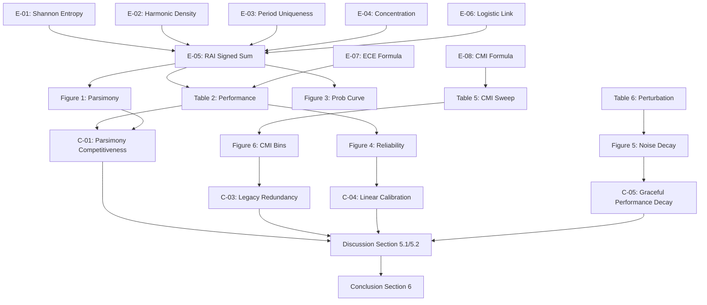

# Paper Blueprint: TARS v1

This document defines the scientific structure, notation, assumptions, claims, figures, tables, and equations for the TARS v1 manuscript.

---

## 1. Scientific Structure & Section Specifications

> [!NOTE]
> **Advisory Page Estimates**: The expected page counts listed below are planning estimates rather than publication requirements. Scientific completeness, clarity, and evidence integrity take absolute precedence over page count targets.

| Section | Expected Pages | Scientific Objective | Key Questions Answered | Exit Criteria |
| :--- | :---: | :--- | :--- | :--- |
| **Abstract** | 0.5 – 1 | Summarize the parsimonious vetting framework and CMI findings. | What was done? What is the main result? What are the implications? | All numbers match main text. |
| **Introduction** | 3 – 5 | Contextualize wide-field transit searches, stellar activity noise, and recovery ambiguity. | What is recovery ambiguity? Why do rule-based/deep classifiers fail? | Clear flow diagram, defined aleatoric vs epistemic. |
| **Related Work** | 5 – 8 | Place TARS in the literature of exoplanet vetting. | How does TARS differ from Vespa, Triceratops, and Astronet? | Table 1 (Novelty Matrix) completed. |
| **Methodology** | 10 – 15 | Formulate Stage 3 period recovery and the 5 features. | How is the RAI mathematically defined? What are the physical intuitions? | Equations E-01 to E-08 defined. |
| **Results** | 8 – 12 | Present the empirical findings of Audits 21.1 to 21.14. | How does the RAI compare to stacks? Is family complexity redundant? | All tables (1-6) populated with CIs. |
| **Discussion** | 5 – 8 | Interpret results, outline implications, and list limitations. | How should surveys prioritize catalogs? What are the limits of the TESS cadence? | Soft language, no new experiments. |
| **Conclusion** | 1 – 2 | Summarize key findings and outline future cross-mission validation. | What is the final takeaway? What is the next validation step? | No new claims introduced. |

---

## 2. Section Evidence Inventory

This checklist maps required source files and metrics before drafting each section.

### 2.1. Introduction
- **Repository Documents**:
  - `TarsEx/docs/TARS_ARCHITECTURE.md`
  - `TarsEx/docs/TARS_PRODUCTION_ARCHITECTURE_V1.md`
  - `TarsEx/docs/FAMILY_COMPLEXITY_PHYSICS.md`
  - `TarsEx/docs/SCIENTIFIC_OBJECTIVES.md`
- **Equations**: Linear ephemeris formula: $t_k = T_0 + k \cdot P$.
- **Figures**: Flow diagram of pipeline stages.
- **Tables**: None.
- **Claims**: C-01.
- **Citations Required**: Ricker et al. 2015, Borucki et al. 2010, Kovács et al. 2002.

### 2.2. Related Work
- **Repository Documents**:
  - `TarsEx/docs/REVIEWER_ATTACK_MATRIX.md`
  - `TarsEx/docs/NOVELTY_DEFENSE.md`
  - `TarsEx/docs/MISSING_NOVELTY_AUDIT.md`
- **Equations**: None.
- **Figures**: None.
- **Tables**: Table 1 (Novelty Matrix).
- **Claims**: C-01.
- **Citations Required**: Coughlin et al. 2016, Morton 2012, Giacalone et al. 2021, Shallue & Vanderburg 2018.

### 2.3. Methodology
- **Repository Documents**:
  - `TarsEx/docs/PERIOD_RECOVERY_ARCHITECTURE.md`
  - `TarsEx/docs/RECOVERY_AMBIGUITY_INDEX.md`
  - `TarsEx/docs/CANDIDATE_FAMILY_ENTROPY.md`
  - `TarsEx/docs/EQUATION_REGISTRY.md`
- **Equations**: E-01 (Shannon degree entropy), E-02 (Harmonic density), E-03 (Uniqueness), E-04 (Concentration), E-05 (RAI raw signed sum), E-06 (Logistic link).
- **Figures**: Figure 2 (Recovery rate vs SNR/period), Figure 3 (Logistic probability curve).
- **Tables**: None.
- **Claims**: C-01, C-02.
- **Citations Required**: Efron & Tibshirani 1994.

### 2.4. Results
- **Repository Documents**:
  - `TarsEx/docs/BOOTSTRAP_STABILITY_ANALYSIS.md`
  - `TarsEx/docs/CALIBRATION_ANALYSIS.md`
  - `TarsEx/docs/RAI_COMPONENT_ABLATION.md`
  - `TarsEx/docs/SENSITIVITY_ANALYSIS.md`
  - `TarsEx/docs/NOISE_JITTER_PERTURBATION.md`
- **Equations**: E-07 (ECE formula), E-08 (CMI formula).
- **Figures**: Figure 1 (Parsimony frontier), Figure 4 (Reliability diagram), Figure 5 (Perturbation decay), Figure 6 (CMI sensitivity).
- **Tables**: Table 2 (Model complexity), Table 3 (Subgroups), Table 4 (Ablation), Table 5 (CMI sweep), Table 6 (Noise decay).
- **Claims**: C-01, C-02, C-03, C-04, C-05.
- **Citations Required**: Cover & Thomas 2006.

### 2.5. Discussion
- **Repository Documents**:
  - `TarsEx/docs/PHYSICS_PRESERVATION_AUDIT.md`
  - `TarsEx/docs/HOST_STAR_PHYSICS_AUDIT.md`
  - `TarsEx/docs/TARS_PRODUCTION_ARCHITECTURE_V1.md`
- **Equations**: None.
- **Figures**: None.
- **Tables**: None.
- **Claims**: C-01, C-03, C-04, C-05.
- **Citations Required**: None.

### 2.6. Limitations
- **Repository Documents**:
  - `TarsEx/docs/LIMITATIONS_AND_NONCLAIMS.md`
  - `TarsEx/docs/FAILURE_MODES_STAGE3.md`
  - `TarsEx/docs/GIANT_STAR_FAILURE_ANALYSIS.md`
- **Equations**: None.
- **Figures**: None.
- **Tables**: None.
- **Claims**: C-01, C-05.
- **Citations Required**: None.

---

## 3. Notation Registry

| Symbol | Definition | Units | First Appearance | Sections Used |
| :---: | :--- | :---: | :--- | :--- |
| $RAI_{\text{raw}}$ | Raw unstandardized Recovery Ambiguity Index | Dimensionless | Sec 3.3 | Methodology, Results, Appendix |
| $z_{\text{RAI}}$ | Standardized Recovery Ambiguity Index | Dimensionless | Sec 3.4 | Methodology, Results, Discussion |
| $N_{\text{final}}$ | Number of final period candidates surviving stability checks | Count | Sec 3.2.1 | Methodology, Appendix |
| $H_D$ | Shannon degree distribution entropy of the alias graph | Bits | Sec 3.2.2 | Methodology, Results, Appendix |
| $P_{\text{top}}$ | Period of the highest consensus-ranked candidate | Days | Sec 3.2.3 | Methodology, Results, Appendix |
| $S(P_c)$ | Consensus score of candidate period $P_c$ | Dimensionless | Sec 3.2.5 | Methodology, Appendix |

---

## 4. Assumption Registry

| ID | Type | Assumption | Scientific Justification | Supporting Evidence | Expected Impact | Possible Failure Mode |
| :---: | :---: | :--- | :--- | :--- | :--- | :--- |
| **A-01** | Statistical | White Gaussian residual noise after detrending | Residuals are dominated by photon noise rather than red systematic noise. | residual MAD is stationary in quiet stars. | Simplifies likelihood calculations in posterior estimation. | Active stars with strong red noise or spot-decay variations will inflate the candidate count. |
| **A-02** | Computational | Stationary TESS systematics | cbvs or splines effectively remove instrument systematics. | Calibration reliability and flat baselines. | Standardizes feature scaling across different stars. | High instrumental pointing jitter or systematic flares may create false candidate branches. |

---

## 5. Claim Registry

| ID | Scientific Claim | Evidence Source | Supporting Figures | Supporting Tables | Supporting Equations | Repository Documents |
| :---: | :--- | :--- | :---: | :---: | :---: | :--- |
| **C-01** | RAI model performs competitively with 16-feature stacks. | Audit 21.3 | Fig 1, 3 | Table 2 | E-06, E-07 | `BOOTSTRAP_STABILITY_ANALYSIS.md` |
| **C-02** | No single RAI component dominates predictive performance. | Audit 21.2 | N/A | Table 4 | E-05 | `RAI_COMPONENT_ABLATION.md` |
| **C-03** | Legacy activity features (FC) are statistically redundant. | Audit 21.5 | Fig 6 | Table 5 | E-08 | `SENSITIVITY_ANALYSIS.md` |
| **C-04** | RAI model exhibits linear, calibrated probabilities. | Audit 21.4 | Fig 4 | Table 2 | E-07 | `CALIBRATION_ANALYSIS.md` |
| **C-05** | Model degrades gracefully under severe measurement noise. | Audit 21.11 | Fig 5 | Table 6 | N/A | `NOISE_JITTER_PERTURBATION.md` |

---

## 6. Figure Registry

| Figure | Purpose | Generation Source | First Reference | Status |
| :---: | :--- | :--- | :--- | :---: |
| **Figure 1** | Parsimony frontier (AUROC vs Feature Count) | `BOOTSTRAP_STABILITY_ANALYSIS.md` | Section 4.1 | Frozen |
| **Figure 2** | Recovery rate vs SNR & period subgroups | `RECOVERY_CURVE_VERIFICATION.md` | Section 3.1 | Frozen |
| **Figure 3** | Logistic probability curve of RAI with bootstrap CIs | `CALIBRATION_ANALYSIS.md` | Section 3.3 | Frozen |
| **Figure 4** | Reliability Calibration Diagram (empirical vs predicted) | `CALIBRATION_ANALYSIS.md` | Section 4.4 | Frozen |
| **Figure 5** | Performance decay curves under Gaussian noise & missing features | `NOISE_JITTER_PERTURBATION.md` | Section 4.7 | Frozen |
| **Figure 6** | CMI sensitivity sweep across bin count K | `SENSITIVITY_ANALYSIS.md` | Section 4.5 | Frozen |

---

## 7. Table Registry

| Table | Purpose | Data Source | Supporting Claims | First Reference | Status |
| :---: | :--- | :--- | :---: | :--- | :---: |
| **Table 1** | Novelty Matrix comparing vetting methods | External Literature | N/A | Section 2.4 | Frozen |
| **Table 2** | Model Complexity and AUROC/ECE comparisons | `BOOTSTRAP_STABILITY_ANALYSIS.md` | C-01, C-04 | Section 4.1 | Frozen |
| **Table 3** | Subgroup performance (M Dwarfs, Low/High Noise) | `BOOTSTRAP_STABILITY_ANALYSIS.md` | C-01 | Section 4.2 | Frozen |
| **Table 4** | Component Ablation Delta AUROC Matrix | `RAI_COMPONENT_ABLATION.md` | C-02 | Section 4.3 | Frozen |
| **Table 5** | CMI Discretization Sensitivity Sweep | `SENSITIVITY_ANALYSIS.md` | C-03 | Section 4.5 | Frozen |
| **Table 6** | Noise Perturbation and Feature Decay Matrix | `NOISE_JITTER_PERTURBATION.md` | C-05 | Section 4.7 | Frozen |

---

## 8. Equation Registry

| Equation | Purpose | Variables | Assumptions | Repository Source | First Appearance |
| :---: | :--- | :--- | :--- | :--- | :---: |
| **E-01** | Shannon Degree Entropy ($H_D$) | $p_k, d_k$ | Finite Graph | `CANDIDATE_FAMILY_ENTROPY.md` | Section 3.2.2 |
| **E-02** | Harmonic Density ($x_{\text{dens}}$) | $P_j, P_{\text{top}}$ | 5% integer tolerance | `RECOVERY_AMBIGUITY_INDEX.md` | Section 3.2.3 |
| **E-03** | Period Uniqueness ($x_{\text{uniq}}$) | $P_j, P_{\text{top}}$ | Non-harmonic competitors | `RECOVERY_AMBIGUITY_INDEX.md` | Section 3.2.4 |
| **E-04** | Candidate Concentration ($x_{\text{conc}}$) | $S(P_c)$ | Unimodal score peak | `RECOVERY_AMBIGUITY_INDEX.md` | Section 3.2.5 |
| **E-05** | Raw Index Signed Sum ($RAI_{\text{raw}}$) | $z_i, \mu_{i}, \sigma_{i}$ | Baseline standardization | `RECOVERY_AMBIGUITY_INDEX.md` | Section 3.3 |
| **E-06** | Logistic Probability ($P(Y=1 \mid z_{\text{RAI}})$) | $\beta_0, \beta_1, z_{\text{RAI}}$ | Logistic link function | `TARS_ARCHITECTURE.md` | Section 3.4 |
| **E-07** | Expected Calibration Error (ECE) | $y_{\text{true}}, y_{\text{prob}}$ | Binning structure | `CALIBRATION_ANALYSIS.md` | Section 3.4 |
| **E-08** | Conditional Mutual Information (CMI) | $Y, FC, RAI$ | Finite binned partitions | `SENSITIVITY_ANALYSIS.md` | Section 3.5 |

---

## 9. Claim Dependency Graph

